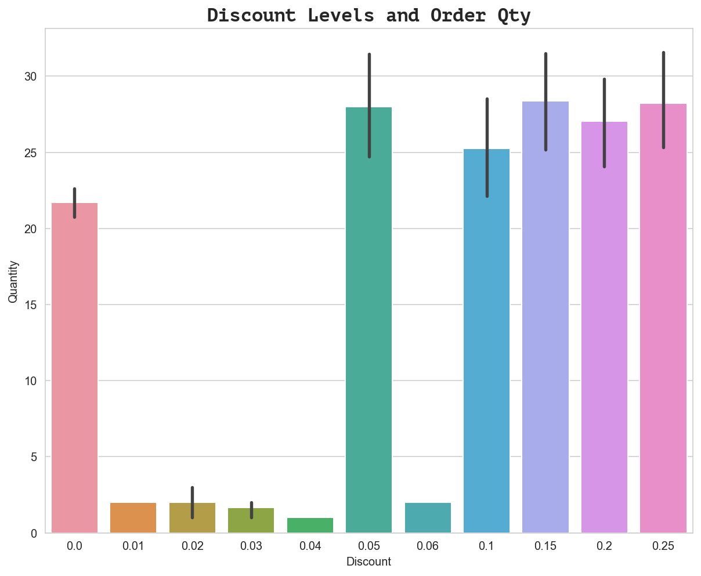
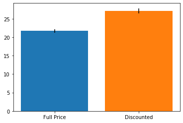
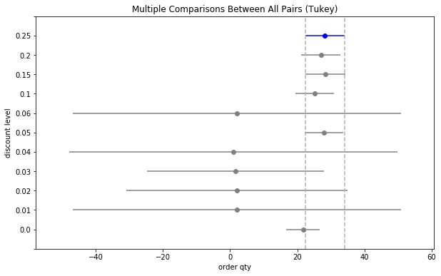
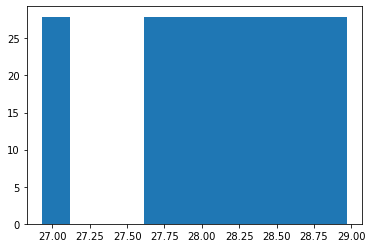

## **Module 3 Final Project**

    Title: Northwinds Database
    Submitted By: RU KEÏN
    Date: December 5, 2019
    Instructor: James Irving PhD
    https://vimeo.com/rukein/northwind-datascience-project-presentation
    http://www.hakkeray.com/datascience/2019/12/07/thinking-outside-the-lego-box.html

---
## Executive Summary

The goal of this project is to recommend business strategies for increasing sales and saving costs for the Northwind company. This project is based on a fictitious business database created by Microsoft for the use of practicing SQL, hypothesis testing and other data analysis related projects. 

Below are 5 hypotheses (each including a null hypothesis and alternative hypothesis) which I will test for statistical significance to determine if there are any relationships which can be gleaned from the data. Following this I will summarize the results, make final recommendations, and propose ideas for future work.

---
## Outline

*Statistical Analysis Pipeline*

For each question below, I will follow a standard process of work as outlined here:
- 1. Question
    - 1.1 Hypotheses
    - 1.2 Exploratory Data Analysis (EDA)
        - 1.2.1 Select dataset
        - 1.2.2 Group data
        - 1.2.3 Explore data
    - 1.3 Test
        - 1.3.1 Sample size
        - 1.3.2 Normality and Variance
        - 1.3.3 Statistical test
        - 1.3.4 Effect size (if necessary)
        - 1.3.5 Post-hoc tests (if necessary)
    - 1.4 Analyze Results


---

The statistical testing process is as follows (section 1.4 above):

1. Check if sample sizes allow us to ignore assumptions by visualizing sample size comparisons for two groups (normality check).
    * Bar Plot: SEM (Standard Error of the Mean)

2. If above test fails, check for normality and homogeneity of variance:
    * Test Assumption Normality:
        - D'Agostino-Pearson: scipy.stats.normaltest
        - Shapiro-Wilik Test: scipy.stats.shapiro
    
    * Test for Homogeneity of Variance:
        - Levene's Test: scipy.stats.levene)

3. Choose appropriate test based on above
    * T Test (1-sample)
         - stats.ttest_1samp()
    * T Test (2-sample)
        - stats.ttest_ind()
    * Welch's T-Test (2-sample)
        - stats.ttest_ind(equal_var=False)
    * Mann Whitney U
        - stats.mannwhitneyu()
    * ANOVA
        - stats.f_oneway()
    * Tukey's
        - statsmodels.stats.multicomp.pairwise_tukeyhsd

4. Calculate effect size for significant results.
    * Effect size: 
        - cohen's d

    -Interpretation:
    - Small effect = 0.2 ( cannot be seen by naked eye)
    - Medium effect = 0.5
    - Large Effect = 0.8 (can be seen by naked eye)


5. If significant, follow up with post-hoc tests (if have more than 2 groups)
    * Tukey's

--------------------------
## Table of Contents

    0. Data Prep

    1. H1: Discount and Order Quantity
    Does discount amount have a statistically significant effect on quantity of product 
    in an order? If so, at what level(s) of discount?
 
    2. H2: Discount and Country
    Do individual countries tend to order more products when a discount is offered? 

    3. H3: Region and Sales Revenue
    Does sales revenue vary by region?

    4. Time of Year (Season) and Revenue/Units Sold
    Does time of year have a statistically significant effect on sales revenue and/or volume of units sold? 

    5. Results Analysis
    
    6. Recommendations and Conclusion

    7. Future Work/Additional Explorations
        A. Customer Satisfaction Improvement (On-time Shipments)
        B. Product Recommendation Tool
            * What are top 3 selling products overall vs each region/country).

## Data Prep


```python
# install requisite libraries and packages
!pip install -U fsds_100719 --user
from fsds_100719.imports import *
```

    fsds_1007219  v0.4.45 loaded.  Read the docs: https://fsds.readthedocs.io/en/latest/ 


<style  type="text/css" >
</style><table id="T_b7898d4c_1b9a_11ea_9ec0_f40f2405a054" ><caption>Loaded Packages and Handles</caption><thead>    <tr>        <th class="col_heading level0 col0" >Handle</th>        <th class="col_heading level0 col1" >Package</th>        <th class="col_heading level0 col2" >Description</th>    </tr></thead><tbody>
                <tr>
                                <td id="T_b7898d4c_1b9a_11ea_9ec0_f40f2405a054row0_col0" class="data row0 col0" >dp</td>
                        <td id="T_b7898d4c_1b9a_11ea_9ec0_f40f2405a054row0_col1" class="data row0 col1" >IPython.display</td>
                        <td id="T_b7898d4c_1b9a_11ea_9ec0_f40f2405a054row0_col2" class="data row0 col2" >Display modules with helpful display and clearing commands.</td>
            </tr>
            <tr>
                                <td id="T_b7898d4c_1b9a_11ea_9ec0_f40f2405a054row1_col0" class="data row1 col0" >fs</td>
                        <td id="T_b7898d4c_1b9a_11ea_9ec0_f40f2405a054row1_col1" class="data row1 col1" >fsds_100719</td>
                        <td id="T_b7898d4c_1b9a_11ea_9ec0_f40f2405a054row1_col2" class="data row1 col2" >Custom data science bootcamp student package</td>
            </tr>
            <tr>
                                <td id="T_b7898d4c_1b9a_11ea_9ec0_f40f2405a054row2_col0" class="data row2 col0" >mpl</td>
                        <td id="T_b7898d4c_1b9a_11ea_9ec0_f40f2405a054row2_col1" class="data row2 col1" >matplotlib</td>
                        <td id="T_b7898d4c_1b9a_11ea_9ec0_f40f2405a054row2_col2" class="data row2 col2" >Matplotlib's base OOP module with formatting artists</td>
            </tr>
            <tr>
                                <td id="T_b7898d4c_1b9a_11ea_9ec0_f40f2405a054row3_col0" class="data row3 col0" >plt</td>
                        <td id="T_b7898d4c_1b9a_11ea_9ec0_f40f2405a054row3_col1" class="data row3 col1" >matplotlib.pyplot</td>
                        <td id="T_b7898d4c_1b9a_11ea_9ec0_f40f2405a054row3_col2" class="data row3 col2" >Matplotlib's matlab-like plotting module</td>
            </tr>
            <tr>
                                <td id="T_b7898d4c_1b9a_11ea_9ec0_f40f2405a054row4_col0" class="data row4 col0" >np</td>
                        <td id="T_b7898d4c_1b9a_11ea_9ec0_f40f2405a054row4_col1" class="data row4 col1" >numpy</td>
                        <td id="T_b7898d4c_1b9a_11ea_9ec0_f40f2405a054row4_col2" class="data row4 col2" >scientific computing with Python</td>
            </tr>
            <tr>
                                <td id="T_b7898d4c_1b9a_11ea_9ec0_f40f2405a054row5_col0" class="data row5 col0" >pd</td>
                        <td id="T_b7898d4c_1b9a_11ea_9ec0_f40f2405a054row5_col1" class="data row5 col1" >pandas</td>
                        <td id="T_b7898d4c_1b9a_11ea_9ec0_f40f2405a054row5_col2" class="data row5 col2" >High performance data structures and tools</td>
            </tr>
            <tr>
                                <td id="T_b7898d4c_1b9a_11ea_9ec0_f40f2405a054row6_col0" class="data row6 col0" >sns</td>
                        <td id="T_b7898d4c_1b9a_11ea_9ec0_f40f2405a054row6_col1" class="data row6 col1" >seaborn</td>
                        <td id="T_b7898d4c_1b9a_11ea_9ec0_f40f2405a054row6_col2" class="data row6 col2" >High-level data visualization library based on matplotlib</td>
            </tr>
    </tbody></table>


```python
from fsds_100719.ds import ihelp, reload
import fsds_100719 as fs
```


```python
fs.ft.hakkeray.hot_stats()
```


    <module 'fsds_100719.ft.hakkeray' from '/Users/hakkeray/opt/anaconda3/envs/learn-env/lib/python3.6/site-packages/fsds_100719/ft/hakkeray.py'>


```python
# connect to database / import data
import sqlite3 
conn = sqlite3.connect('Northwind_small.sqlite')
cur = conn.cursor()
```


```python
# function for converting tables into dataframes on the fly
def get_table(cur, table):
    cur.execute(f"SELECT * from {table};")
    df = pd.DataFrame(cur.fetchall())
    df.columns = [desc[0] for desc in cur.description]
    return df
```


```python
# create dataframe of table names for referencing purposes
cur.execute("""SELECT name from sqlite_master WHERE type='table';""")
df_tables = pd.DataFrame(cur.fetchall(), columns=['Table'])
df_tables
```


<div>
<style scoped>
    .dataframe tbody tr th:only-of-type {
        vertical-align: middle;
    }

    .dataframe tbody tr th {
        vertical-align: top;
    }

    .dataframe thead th {
        text-align: right;
    }
</style>
<table border="1" class="dataframe">
  <thead>
    <tr style="text-align: right;">
      <th></th>
      <th>Table</th>
    </tr>
  </thead>
  <tbody>
    <tr>
      <td>0</td>
      <td>Employee</td>
    </tr>
    <tr>
      <td>1</td>
      <td>Category</td>
    </tr>
    <tr>
      <td>2</td>
      <td>Customer</td>
    </tr>
    <tr>
      <td>3</td>
      <td>Shipper</td>
    </tr>
    <tr>
      <td>4</td>
      <td>Supplier</td>
    </tr>
    <tr>
      <td>5</td>
      <td>Order</td>
    </tr>
    <tr>
      <td>6</td>
      <td>Product</td>
    </tr>
    <tr>
      <td>7</td>
      <td>OrderDetail</td>
    </tr>
    <tr>
      <td>8</td>
      <td>CustomerCustomerDemo</td>
    </tr>
    <tr>
      <td>9</td>
      <td>CustomerDemographic</td>
    </tr>
    <tr>
      <td>10</td>
      <td>Region</td>
    </tr>
    <tr>
      <td>11</td>
      <td>Territory</td>
    </tr>
    <tr>
      <td>12</td>
      <td>EmployeeTerritory</td>
    </tr>
  </tbody>
</table>
</div>


```python
from IPython.display import HTML
HTML('')

```


# H1: Discount--Quantity

* Does discount amount have a statistically significant effect on the quantity of a product in an order? 
* If so, at what level(s) of discount?

## Hypotheses
- $H_0$: Discount amount has no relationship with the quantity of a product in an order.
- $H_A$: Discount amount has a statistically significant effect on the quantity in an order.

- $\alpha$=0.05

## EDA
Select the proper dataset for analysis, perform EDA, and generate data groups for testing.

### Select dataset


```python
df_orderDetail = get_table(cur, 'OrderDetail')
df_orderDetail.head()
```


<div>
<style scoped>
    .dataframe tbody tr th:only-of-type {
        vertical-align: middle;
    }

    .dataframe tbody tr th {
        vertical-align: top;
    }

    .dataframe thead th {
        text-align: right;
    }
</style>
<table border="1" class="dataframe">
  <thead>
    <tr style="text-align: right;">
      <th></th>
      <th>Id</th>
      <th>OrderId</th>
      <th>ProductId</th>
      <th>UnitPrice</th>
      <th>Quantity</th>
      <th>Discount</th>
    </tr>
  </thead>
  <tbody>
    <tr>
      <td>0</td>
      <td>10248/11</td>
      <td>10248</td>
      <td>11</td>
      <td>14.0</td>
      <td>12</td>
      <td>0.0</td>
    </tr>
    <tr>
      <td>1</td>
      <td>10248/42</td>
      <td>10248</td>
      <td>42</td>
      <td>9.8</td>
      <td>10</td>
      <td>0.0</td>
    </tr>
    <tr>
      <td>2</td>
      <td>10248/72</td>
      <td>10248</td>
      <td>72</td>
      <td>34.8</td>
      <td>5</td>
      <td>0.0</td>
    </tr>
    <tr>
      <td>3</td>
      <td>10249/14</td>
      <td>10249</td>
      <td>14</td>
      <td>18.6</td>
      <td>9</td>
      <td>0.0</td>
    </tr>
    <tr>
      <td>4</td>
      <td>10249/51</td>
      <td>10249</td>
      <td>51</td>
      <td>42.4</td>
      <td>40</td>
      <td>0.0</td>
    </tr>
  </tbody>
</table>
</div>


### Group


```python
# check value counts for each level of discount
df_orderDetail['Discount'].value_counts()
```


    0.00    1317
    0.05     185
    0.10     173
    0.20     161
    0.15     157
    0.25     154
    0.03       3
    0.02       2
    0.01       1
    0.04       1
    0.06       1
    Name: Discount, dtype: int64


```python
# insert boolean column showing whether or not an order was discounted
df_orderDetail['discounted'] = np.where(df_orderDetail['Discount'] == 0.0, 0, 1)

# compare number of discount vs fullprice orders
df_orderDetail['discounted'].value_counts()
```


    0    1317
    1     838
    Name: discounted, dtype: int64


```python
# split orders into two groups: discount and fullprice
fullprice = df_orderDetail.groupby('discounted').get_group(0)['Quantity']
discount = df_orderDetail.groupby('discounted').get_group(1)['Quantity']

display(fullprice.head())
display(discount.head())
```


    0    12
    1    10
    2     5
    3     9
    4    40
    Name: Quantity, dtype: int64


    6     35
    7     15
    8      6
    9     15
    11    40
    Name: Quantity, dtype: int64


### Explore


```python
fullprice.mean()
```


    21.715261958997722


```python
discount.mean()
```


    27.10978520286396


At first glance it looks like the average quantities are indeed higher for discounted orders compared to those that are full price.


```python
## Examine KDEs
fig, ax = plt.subplots(figsize=(10,6))

group1 = {'name':'fullprice',
         'data':fullprice,
         'n':fullprice.value_counts()}
plot1 = {'hist_kws':dict(color='blue',lw=2, ls='-')}

group2 = {'name':'discount',
         'data':discount,
         'n':discount.value_counts()}
plot2 = {'hist_kws':dict(color='orange',lw=2, ls='-')}


label1= f"{group1['name']} n={group1['n']}"
sns.distplot(group1['data'], label=label1,
             ax=ax, hist_kws=plot1['hist_kws'])
# ax.legend()

label2= f"{group2['name']} n={group2['n']}"
sns.distplot(group2['data'], label=label2,
             ax=ax,hist_kws=plot2['hist_kws'])
# ax.legend()

ax.axvline(group1['data'].mean(),color=plot1['hist_kws']['color'], ls='--')
ax.axvline(group2['data'].mean(),color=plot2['hist_kws']['color'], ls='--')
```


    <matplotlib.lines.Line2D at 0x1c268274e0>





## Test
**Select the appropriate t-test based on tests for the assumptions of normality and homogeneity of variance.**

### Sample Size
Check if sample sizes allow us to ignore assumptions; if not, test assumption normality.


```python
# visualize sample size comparisons for two groups (normality check)
import scipy.stats as stat
plt.bar(x='Full Price', height=fullprice.mean(), yerr=stat.sem(fullprice))
plt.bar(x='Discounted', height=discount.mean(), yerr=stat.sem(discount))
```


    <BarContainer object of 1 artists>





### Normality Test
Check assumptions of normality and homogeneity of variance


```python
# Test for normality - D'Agostino-Pearson's normality test: scipy.stats.normaltest
stat.normaltest(fullprice), stat.normaltest(discount)
```


    (NormaltestResult(statistic=544.5770045551502, pvalue=5.579637380545965e-119),
     NormaltestResult(statistic=261.528012299789, pvalue=1.6214878452829618e-57))


Failed normality test (p-values < 0.05). Run non-parametric test:


```python
# Run non-parametric test (since normality test failed)
stat.mannwhitneyu(fullprice, discount)
```


    MannwhitneyuResult(statistic=461541.0, pvalue=6.629381826999866e-11)


### Statistical Test
Perform chosen statistical test.


```python
# run tukey test for OQD (Order Quantity Discount) 
data = df_orderDetail['Quantity'].values
labels = df_orderDetail['Discount'].values

import statsmodels.api as sms
model = sms.stats.multicomp.pairwise_tukeyhsd(data,labels)
```


```python
# save OQD tukey test model results into dataframe (OQD: order quantity discount)
tukey_OQD = pd.DataFrame(data=model._results_table[1:], columns=model._results_table[0])
tukey_OQD
```


<div>
<style scoped>
    .dataframe tbody tr th:only-of-type {
        vertical-align: middle;
    }

    .dataframe tbody tr th {
        vertical-align: top;
    }

    .dataframe thead th {
        text-align: right;
    }
</style>
<table border="1" class="dataframe">
  <thead>
    <tr style="text-align: right;">
      <th></th>
      <th>group1</th>
      <th>group2</th>
      <th>meandiff</th>
      <th>p-adj</th>
      <th>lower</th>
      <th>upper</th>
      <th>reject</th>
    </tr>
  </thead>
  <tbody>
    <tr>
      <td>0</td>
      <td>0.0</td>
      <td>0.01</td>
      <td>-19.7153</td>
      <td>0.9</td>
      <td>-80.3306</td>
      <td>40.9001</td>
      <td>False</td>
    </tr>
    <tr>
      <td>1</td>
      <td>0.0</td>
      <td>0.02</td>
      <td>-19.7153</td>
      <td>0.9</td>
      <td>-62.593</td>
      <td>23.1625</td>
      <td>False</td>
    </tr>
    <tr>
      <td>2</td>
      <td>0.0</td>
      <td>0.03</td>
      <td>-20.0486</td>
      <td>0.725</td>
      <td>-55.0714</td>
      <td>14.9742</td>
      <td>False</td>
    </tr>
    <tr>
      <td>3</td>
      <td>0.0</td>
      <td>0.04</td>
      <td>-20.7153</td>
      <td>0.9</td>
      <td>-81.3306</td>
      <td>39.9001</td>
      <td>False</td>
    </tr>
    <tr>
      <td>4</td>
      <td>0.0</td>
      <td>0.05</td>
      <td>6.2955</td>
      <td>0.0011</td>
      <td>1.5381</td>
      <td>11.053</td>
      <td>True</td>
    </tr>
    <tr>
      <td>5</td>
      <td>0.0</td>
      <td>0.06</td>
      <td>-19.7153</td>
      <td>0.9</td>
      <td>-80.3306</td>
      <td>40.9001</td>
      <td>False</td>
    </tr>
    <tr>
      <td>6</td>
      <td>0.0</td>
      <td>0.1</td>
      <td>3.5217</td>
      <td>0.4269</td>
      <td>-1.3783</td>
      <td>8.4217</td>
      <td>False</td>
    </tr>
    <tr>
      <td>7</td>
      <td>0.0</td>
      <td>0.15</td>
      <td>6.6669</td>
      <td>0.0014</td>
      <td>1.551</td>
      <td>11.7828</td>
      <td>True</td>
    </tr>
    <tr>
      <td>8</td>
      <td>0.0</td>
      <td>0.2</td>
      <td>5.3096</td>
      <td>0.0303</td>
      <td>0.2508</td>
      <td>10.3684</td>
      <td>True</td>
    </tr>
    <tr>
      <td>9</td>
      <td>0.0</td>
      <td>0.25</td>
      <td>6.525</td>
      <td>0.0023</td>
      <td>1.3647</td>
      <td>11.6852</td>
      <td>True</td>
    </tr>
    <tr>
      <td>10</td>
      <td>0.01</td>
      <td>0.02</td>
      <td>0.0</td>
      <td>0.9</td>
      <td>-74.2101</td>
      <td>74.2101</td>
      <td>False</td>
    </tr>
    <tr>
      <td>11</td>
      <td>0.01</td>
      <td>0.03</td>
      <td>-0.3333</td>
      <td>0.9</td>
      <td>-70.2993</td>
      <td>69.6326</td>
      <td>False</td>
    </tr>
    <tr>
      <td>12</td>
      <td>0.01</td>
      <td>0.04</td>
      <td>-1.0</td>
      <td>0.9</td>
      <td>-86.6905</td>
      <td>84.6905</td>
      <td>False</td>
    </tr>
    <tr>
      <td>13</td>
      <td>0.01</td>
      <td>0.05</td>
      <td>26.0108</td>
      <td>0.9</td>
      <td>-34.745</td>
      <td>86.7667</td>
      <td>False</td>
    </tr>
    <tr>
      <td>14</td>
      <td>0.01</td>
      <td>0.06</td>
      <td>0.0</td>
      <td>0.9</td>
      <td>-85.6905</td>
      <td>85.6905</td>
      <td>False</td>
    </tr>
    <tr>
      <td>15</td>
      <td>0.01</td>
      <td>0.1</td>
      <td>23.237</td>
      <td>0.9</td>
      <td>-37.5302</td>
      <td>84.0042</td>
      <td>False</td>
    </tr>
    <tr>
      <td>16</td>
      <td>0.01</td>
      <td>0.15</td>
      <td>26.3822</td>
      <td>0.9</td>
      <td>-34.4028</td>
      <td>87.1671</td>
      <td>False</td>
    </tr>
    <tr>
      <td>17</td>
      <td>0.01</td>
      <td>0.2</td>
      <td>25.0248</td>
      <td>0.9</td>
      <td>-35.7554</td>
      <td>85.805</td>
      <td>False</td>
    </tr>
    <tr>
      <td>18</td>
      <td>0.01</td>
      <td>0.25</td>
      <td>26.2403</td>
      <td>0.9</td>
      <td>-34.5485</td>
      <td>87.029</td>
      <td>False</td>
    </tr>
    <tr>
      <td>19</td>
      <td>0.02</td>
      <td>0.03</td>
      <td>-0.3333</td>
      <td>0.9</td>
      <td>-55.6463</td>
      <td>54.9796</td>
      <td>False</td>
    </tr>
    <tr>
      <td>20</td>
      <td>0.02</td>
      <td>0.04</td>
      <td>-1.0</td>
      <td>0.9</td>
      <td>-75.2101</td>
      <td>73.2101</td>
      <td>False</td>
    </tr>
    <tr>
      <td>21</td>
      <td>0.02</td>
      <td>0.05</td>
      <td>26.0108</td>
      <td>0.6622</td>
      <td>-17.0654</td>
      <td>69.087</td>
      <td>False</td>
    </tr>
    <tr>
      <td>22</td>
      <td>0.02</td>
      <td>0.06</td>
      <td>0.0</td>
      <td>0.9</td>
      <td>-74.2101</td>
      <td>74.2101</td>
      <td>False</td>
    </tr>
    <tr>
      <td>23</td>
      <td>0.02</td>
      <td>0.1</td>
      <td>23.237</td>
      <td>0.7914</td>
      <td>-19.8552</td>
      <td>66.3292</td>
      <td>False</td>
    </tr>
    <tr>
      <td>24</td>
      <td>0.02</td>
      <td>0.15</td>
      <td>26.3822</td>
      <td>0.6461</td>
      <td>-16.7351</td>
      <td>69.4994</td>
      <td>False</td>
    </tr>
    <tr>
      <td>25</td>
      <td>0.02</td>
      <td>0.2</td>
      <td>25.0248</td>
      <td>0.7089</td>
      <td>-18.0857</td>
      <td>68.1354</td>
      <td>False</td>
    </tr>
    <tr>
      <td>26</td>
      <td>0.02</td>
      <td>0.25</td>
      <td>26.2403</td>
      <td>0.6528</td>
      <td>-16.8823</td>
      <td>69.3628</td>
      <td>False</td>
    </tr>
    <tr>
      <td>27</td>
      <td>0.03</td>
      <td>0.04</td>
      <td>-0.6667</td>
      <td>0.9</td>
      <td>-70.6326</td>
      <td>69.2993</td>
      <td>False</td>
    </tr>
    <tr>
      <td>28</td>
      <td>0.03</td>
      <td>0.05</td>
      <td>26.3441</td>
      <td>0.3639</td>
      <td>-8.9214</td>
      <td>61.6096</td>
      <td>False</td>
    </tr>
    <tr>
      <td>29</td>
      <td>0.03</td>
      <td>0.06</td>
      <td>0.3333</td>
      <td>0.9</td>
      <td>-69.6326</td>
      <td>70.2993</td>
      <td>False</td>
    </tr>
    <tr>
      <td>30</td>
      <td>0.03</td>
      <td>0.1</td>
      <td>23.5703</td>
      <td>0.5338</td>
      <td>-11.7147</td>
      <td>58.8553</td>
      <td>False</td>
    </tr>
    <tr>
      <td>31</td>
      <td>0.03</td>
      <td>0.15</td>
      <td>26.7155</td>
      <td>0.3436</td>
      <td>-8.6001</td>
      <td>62.0311</td>
      <td>False</td>
    </tr>
    <tr>
      <td>32</td>
      <td>0.03</td>
      <td>0.2</td>
      <td>25.3582</td>
      <td>0.428</td>
      <td>-9.9492</td>
      <td>60.6656</td>
      <td>False</td>
    </tr>
    <tr>
      <td>33</td>
      <td>0.03</td>
      <td>0.25</td>
      <td>26.5736</td>
      <td>0.3525</td>
      <td>-8.7485</td>
      <td>61.8957</td>
      <td>False</td>
    </tr>
    <tr>
      <td>34</td>
      <td>0.04</td>
      <td>0.05</td>
      <td>27.0108</td>
      <td>0.9</td>
      <td>-33.745</td>
      <td>87.7667</td>
      <td>False</td>
    </tr>
    <tr>
      <td>35</td>
      <td>0.04</td>
      <td>0.06</td>
      <td>1.0</td>
      <td>0.9</td>
      <td>-84.6905</td>
      <td>86.6905</td>
      <td>False</td>
    </tr>
    <tr>
      <td>36</td>
      <td>0.04</td>
      <td>0.1</td>
      <td>24.237</td>
      <td>0.9</td>
      <td>-36.5302</td>
      <td>85.0042</td>
      <td>False</td>
    </tr>
    <tr>
      <td>37</td>
      <td>0.04</td>
      <td>0.15</td>
      <td>27.3822</td>
      <td>0.9</td>
      <td>-33.4028</td>
      <td>88.1671</td>
      <td>False</td>
    </tr>
    <tr>
      <td>38</td>
      <td>0.04</td>
      <td>0.2</td>
      <td>26.0248</td>
      <td>0.9</td>
      <td>-34.7554</td>
      <td>86.805</td>
      <td>False</td>
    </tr>
    <tr>
      <td>39</td>
      <td>0.04</td>
      <td>0.25</td>
      <td>27.2403</td>
      <td>0.9</td>
      <td>-33.5485</td>
      <td>88.029</td>
      <td>False</td>
    </tr>
    <tr>
      <td>40</td>
      <td>0.05</td>
      <td>0.06</td>
      <td>-26.0108</td>
      <td>0.9</td>
      <td>-86.7667</td>
      <td>34.745</td>
      <td>False</td>
    </tr>
    <tr>
      <td>41</td>
      <td>0.05</td>
      <td>0.1</td>
      <td>-2.7738</td>
      <td>0.9</td>
      <td>-9.1822</td>
      <td>3.6346</td>
      <td>False</td>
    </tr>
    <tr>
      <td>42</td>
      <td>0.05</td>
      <td>0.15</td>
      <td>0.3714</td>
      <td>0.9</td>
      <td>-6.2036</td>
      <td>6.9463</td>
      <td>False</td>
    </tr>
    <tr>
      <td>43</td>
      <td>0.05</td>
      <td>0.2</td>
      <td>-0.986</td>
      <td>0.9</td>
      <td>-7.5166</td>
      <td>5.5447</td>
      <td>False</td>
    </tr>
    <tr>
      <td>44</td>
      <td>0.05</td>
      <td>0.25</td>
      <td>0.2294</td>
      <td>0.9</td>
      <td>-6.3801</td>
      <td>6.839</td>
      <td>False</td>
    </tr>
    <tr>
      <td>45</td>
      <td>0.06</td>
      <td>0.1</td>
      <td>23.237</td>
      <td>0.9</td>
      <td>-37.5302</td>
      <td>84.0042</td>
      <td>False</td>
    </tr>
    <tr>
      <td>46</td>
      <td>0.06</td>
      <td>0.15</td>
      <td>26.3822</td>
      <td>0.9</td>
      <td>-34.4028</td>
      <td>87.1671</td>
      <td>False</td>
    </tr>
    <tr>
      <td>47</td>
      <td>0.06</td>
      <td>0.2</td>
      <td>25.0248</td>
      <td>0.9</td>
      <td>-35.7554</td>
      <td>85.805</td>
      <td>False</td>
    </tr>
    <tr>
      <td>48</td>
      <td>0.06</td>
      <td>0.25</td>
      <td>26.2403</td>
      <td>0.9</td>
      <td>-34.5485</td>
      <td>87.029</td>
      <td>False</td>
    </tr>
    <tr>
      <td>49</td>
      <td>0.1</td>
      <td>0.15</td>
      <td>3.1452</td>
      <td>0.9</td>
      <td>-3.5337</td>
      <td>9.824</td>
      <td>False</td>
    </tr>
    <tr>
      <td>50</td>
      <td>0.1</td>
      <td>0.2</td>
      <td>1.7879</td>
      <td>0.9</td>
      <td>-4.8474</td>
      <td>8.4231</td>
      <td>False</td>
    </tr>
    <tr>
      <td>51</td>
      <td>0.1</td>
      <td>0.25</td>
      <td>3.0033</td>
      <td>0.9</td>
      <td>-3.7096</td>
      <td>9.7161</td>
      <td>False</td>
    </tr>
    <tr>
      <td>52</td>
      <td>0.15</td>
      <td>0.2</td>
      <td>-1.3573</td>
      <td>0.9</td>
      <td>-8.1536</td>
      <td>5.4389</td>
      <td>False</td>
    </tr>
    <tr>
      <td>53</td>
      <td>0.15</td>
      <td>0.25</td>
      <td>-0.1419</td>
      <td>0.9</td>
      <td>-7.014</td>
      <td>6.7302</td>
      <td>False</td>
    </tr>
    <tr>
      <td>54</td>
      <td>0.2</td>
      <td>0.25</td>
      <td>1.2154</td>
      <td>0.9</td>
      <td>-5.6143</td>
      <td>8.0451</td>
      <td>False</td>
    </tr>
  </tbody>
</table>
</div>


```python
# Plot a universal confidence interval of each group mean comparing significant differences in group means. 
# Significant differences at the alpha=0.05 level can be identified by intervals that do not overlap 

oq_data = df_orderDetail['Quantity'].values
discount_labels = df_orderDetail['Discount'].values

from statsmodels.stats.multicomp import MultiComparison
oqd = MultiComparison(oq_data, discount_labels)
results = oqd.tukeyhsd()
results.plot_simultaneous(comparison_name=0.25, xlabel='order qty', ylabel='discount level')
```





### Effect Size
Calculate effect size using Cohen's D as well as any post-hoc tests.


```python
#### Cohen's d
def Cohen_d(group1, group2):
    # Compute Cohen's d.
    # group1: Series or NumPy array
    # group2: Series or NumPy array
    # returns a floating point number 
    diff = group1.mean() - group2.mean()

    n1, n2 = len(group1), len(group2)
    var1 = group1.var()
    var2 = group2.var()

    # Calculate the pooled threshold as shown earlier
    pooled_var = (n1 * var1 + n2 * var2) / (n1 + n2)
    
    # Calculate Cohen's d statistic
    d = diff / np.sqrt(pooled_var)
    
    return d
```


```python
Cohen_d(discount, fullprice)
```


    0.2862724481729282


### Post-hoc Tests


```python
df_oqd = df_orderDetail.loc[(df_orderDetail['Discount'] >= 0.05) & (df_orderDetail['Discount'] != 0.06) & (df_orderDetail['Discount'] != 0.1)]
df_oqd
```


<div>
<style scoped>
    .dataframe tbody tr th:only-of-type {
        vertical-align: middle;
    }

    .dataframe tbody tr th {
        vertical-align: top;
    }

    .dataframe thead th {
        text-align: right;
    }
</style>
<table border="1" class="dataframe">
  <thead>
    <tr style="text-align: right;">
      <th></th>
      <th>Id</th>
      <th>OrderId</th>
      <th>ProductId</th>
      <th>UnitPrice</th>
      <th>Quantity</th>
      <th>Discount</th>
      <th>discounted</th>
    </tr>
  </thead>
  <tbody>
    <tr>
      <td>6</td>
      <td>10250/51</td>
      <td>10250</td>
      <td>51</td>
      <td>42.4</td>
      <td>35</td>
      <td>0.15</td>
      <td>1</td>
    </tr>
    <tr>
      <td>7</td>
      <td>10250/65</td>
      <td>10250</td>
      <td>65</td>
      <td>16.8</td>
      <td>15</td>
      <td>0.15</td>
      <td>1</td>
    </tr>
    <tr>
      <td>8</td>
      <td>10251/22</td>
      <td>10251</td>
      <td>22</td>
      <td>16.8</td>
      <td>6</td>
      <td>0.05</td>
      <td>1</td>
    </tr>
    <tr>
      <td>9</td>
      <td>10251/57</td>
      <td>10251</td>
      <td>57</td>
      <td>15.6</td>
      <td>15</td>
      <td>0.05</td>
      <td>1</td>
    </tr>
    <tr>
      <td>11</td>
      <td>10252/20</td>
      <td>10252</td>
      <td>20</td>
      <td>64.8</td>
      <td>40</td>
      <td>0.05</td>
      <td>1</td>
    </tr>
    <tr>
      <td>...</td>
      <td>...</td>
      <td>...</td>
      <td>...</td>
      <td>...</td>
      <td>...</td>
      <td>...</td>
      <td>...</td>
    </tr>
    <tr>
      <td>2129</td>
      <td>11076/19</td>
      <td>11076</td>
      <td>19</td>
      <td>9.2</td>
      <td>10</td>
      <td>0.25</td>
      <td>1</td>
    </tr>
    <tr>
      <td>2130</td>
      <td>11077/2</td>
      <td>11077</td>
      <td>2</td>
      <td>19.0</td>
      <td>24</td>
      <td>0.20</td>
      <td>1</td>
    </tr>
    <tr>
      <td>2134</td>
      <td>11077/7</td>
      <td>11077</td>
      <td>7</td>
      <td>30.0</td>
      <td>1</td>
      <td>0.05</td>
      <td>1</td>
    </tr>
    <tr>
      <td>2137</td>
      <td>11077/12</td>
      <td>11077</td>
      <td>12</td>
      <td>38.0</td>
      <td>2</td>
      <td>0.05</td>
      <td>1</td>
    </tr>
    <tr>
      <td>2144</td>
      <td>11077/39</td>
      <td>11077</td>
      <td>39</td>
      <td>18.0</td>
      <td>2</td>
      <td>0.05</td>
      <td>1</td>
    </tr>
  </tbody>
</table>
<p>657 rows × 7 columns</p>
</div>


```python
df_oqd['OQD'] = 1
df_oqd
```

    /Users/hakkeray/opt/anaconda3/envs/learn-env/lib/python3.6/site-packages/ipykernel_launcher.py:1: SettingWithCopyWarning: 
    A value is trying to be set on a copy of a slice from a DataFrame.
    Try using .loc[row_indexer,col_indexer] = value instead
    
    See the caveats in the documentation: http://pandas.pydata.org/pandas-docs/stable/user_guide/indexing.html#returning-a-view-versus-a-copy
      """Entry point for launching an IPython kernel.


<div>
<style scoped>
    .dataframe tbody tr th:only-of-type {
        vertical-align: middle;
    }

    .dataframe tbody tr th {
        vertical-align: top;
    }

    .dataframe thead th {
        text-align: right;
    }
</style>
<table border="1" class="dataframe">
  <thead>
    <tr style="text-align: right;">
      <th></th>
      <th>Id</th>
      <th>OrderId</th>
      <th>ProductId</th>
      <th>UnitPrice</th>
      <th>Quantity</th>
      <th>Discount</th>
      <th>discounted</th>
      <th>OQD</th>
    </tr>
  </thead>
  <tbody>
    <tr>
      <td>6</td>
      <td>10250/51</td>
      <td>10250</td>
      <td>51</td>
      <td>42.4</td>
      <td>35</td>
      <td>0.15</td>
      <td>1</td>
      <td>1</td>
    </tr>
    <tr>
      <td>7</td>
      <td>10250/65</td>
      <td>10250</td>
      <td>65</td>
      <td>16.8</td>
      <td>15</td>
      <td>0.15</td>
      <td>1</td>
      <td>1</td>
    </tr>
    <tr>
      <td>8</td>
      <td>10251/22</td>
      <td>10251</td>
      <td>22</td>
      <td>16.8</td>
      <td>6</td>
      <td>0.05</td>
      <td>1</td>
      <td>1</td>
    </tr>
    <tr>
      <td>9</td>
      <td>10251/57</td>
      <td>10251</td>
      <td>57</td>
      <td>15.6</td>
      <td>15</td>
      <td>0.05</td>
      <td>1</td>
      <td>1</td>
    </tr>
    <tr>
      <td>11</td>
      <td>10252/20</td>
      <td>10252</td>
      <td>20</td>
      <td>64.8</td>
      <td>40</td>
      <td>0.05</td>
      <td>1</td>
      <td>1</td>
    </tr>
    <tr>
      <td>...</td>
      <td>...</td>
      <td>...</td>
      <td>...</td>
      <td>...</td>
      <td>...</td>
      <td>...</td>
      <td>...</td>
      <td>...</td>
    </tr>
    <tr>
      <td>2129</td>
      <td>11076/19</td>
      <td>11076</td>
      <td>19</td>
      <td>9.2</td>
      <td>10</td>
      <td>0.25</td>
      <td>1</td>
      <td>1</td>
    </tr>
    <tr>
      <td>2130</td>
      <td>11077/2</td>
      <td>11077</td>
      <td>2</td>
      <td>19.0</td>
      <td>24</td>
      <td>0.20</td>
      <td>1</td>
      <td>1</td>
    </tr>
    <tr>
      <td>2134</td>
      <td>11077/7</td>
      <td>11077</td>
      <td>7</td>
      <td>30.0</td>
      <td>1</td>
      <td>0.05</td>
      <td>1</td>
      <td>1</td>
    </tr>
    <tr>
      <td>2137</td>
      <td>11077/12</td>
      <td>11077</td>
      <td>12</td>
      <td>38.0</td>
      <td>2</td>
      <td>0.05</td>
      <td>1</td>
      <td>1</td>
    </tr>
    <tr>
      <td>2144</td>
      <td>11077/39</td>
      <td>11077</td>
      <td>39</td>
      <td>18.0</td>
      <td>2</td>
      <td>0.05</td>
      <td>1</td>
      <td>1</td>
    </tr>
  </tbody>
</table>
<p>657 rows × 8 columns</p>
</div>


```python
df_oqd.groupby(['Discount'])['Quantity'].mean().plot.bar()
```


    <matplotlib.axes._subplots.AxesSubplot at 0x1c213b42b0>





```python
fig = plt.figure(figsize=(8,6))
plt.hist(data=df_oqd, x='Discount', bins=dv)
```


    (array([185.,   0., 157., 315.]),
     array([0.05, 0.1 , 0.15, 0.2 , 0.25]),
     <a list of 4 Patch objects>)


```python
df_orderDetail['OQD'] = df_oqd['OQD']
df_orderDetail['OQD'].fillna(0, inplace=True)
df_orderDetail['OQD'].value_counts()
```


    0.0    1498
    1.0     657
    Name: OQD, dtype: int64


```python
# dataframe containing insignificant discount levels
fullprice_df = df_orderDetail.loc[df_orderDetail['OQD'] == 0]
# dataframe containing significant discount levels
discount_df = df_orderDetail.loc[df_orderDetail['OQD'] == 1]
```


```python
mean_qty_fp = fullprice_df.Quantity.mean()
mean_qty_dc = discount_df.Quantity.mean()
print(mean_qty_fp, mean_qty_dc)
```

    22.01535380507343 27.911719939117198


```python
diff = mean_qty_dc - mean_qty_fp
diff
```


    5.896366134043767


```python
from pandas_profiling import ProfileReport
#ProfileReport(df_oqd)
```


```python
sns.distplot(df_orderDetail.Quantity)
sns.distplot(df_oqd.Quantity)
```


    <matplotlib.axes._subplots.AxesSubplot at 0x1c25997a90>


## Analyze Results

The null hypothesis is rejected. Discount amount has a statistically significant effect on the quantity in an order where the discount level is equal to 5%, 15%, 20% or 25%.

NOTES - be more precise (pvalue for test and effect size, therefore rejecting etc)

# H2: Country--Discount

**Do individual countries show a statistically significant preference for discount?**

**If so, which countries and to what extent?** 

## Hypotheses

- $H_0$: Countries purchase equal quantities of discounted vs non-discounted products.
- $H_A$: Countries purchase different quantities of discounted vs non-discounted products.

## EDA
Select the proper dataset for analysis, perform EDA, and generate data groups for testing.

### Select


```python
df_order = get_table(cur, "'Order'")
display(df_order.head())
display(df_orderDetail.head())
```


<div>
<style scoped>
    .dataframe tbody tr th:only-of-type {
        vertical-align: middle;
    }

    .dataframe tbody tr th {
        vertical-align: top;
    }

    .dataframe thead th {
        text-align: right;
    }
</style>
<table border="1" class="dataframe">
  <thead>
    <tr style="text-align: right;">
      <th></th>
      <th>OrderId</th>
      <th>CustomerId</th>
      <th>EmployeeId</th>
      <th>OrderDate</th>
      <th>RequiredDate</th>
      <th>ShippedDate</th>
      <th>ShipVia</th>
      <th>Freight</th>
      <th>ShipName</th>
      <th>ShipAddress</th>
      <th>ShipCity</th>
      <th>ShipRegion</th>
      <th>ShipPostalCode</th>
      <th>ShipCountry</th>
    </tr>
  </thead>
  <tbody>
    <tr>
      <td>0</td>
      <td>10248</td>
      <td>VINET</td>
      <td>5</td>
      <td>2012-07-04</td>
      <td>2012-08-01</td>
      <td>2012-07-16</td>
      <td>3</td>
      <td>32.38</td>
      <td>Vins et alcools Chevalier</td>
      <td>59 rue de l'Abbaye</td>
      <td>Reims</td>
      <td>Western Europe</td>
      <td>51100</td>
      <td>France</td>
    </tr>
    <tr>
      <td>1</td>
      <td>10249</td>
      <td>TOMSP</td>
      <td>6</td>
      <td>2012-07-05</td>
      <td>2012-08-16</td>
      <td>2012-07-10</td>
      <td>1</td>
      <td>11.61</td>
      <td>Toms Spezialitäten</td>
      <td>Luisenstr. 48</td>
      <td>Münster</td>
      <td>Western Europe</td>
      <td>44087</td>
      <td>Germany</td>
    </tr>
    <tr>
      <td>2</td>
      <td>10250</td>
      <td>HANAR</td>
      <td>4</td>
      <td>2012-07-08</td>
      <td>2012-08-05</td>
      <td>2012-07-12</td>
      <td>2</td>
      <td>65.83</td>
      <td>Hanari Carnes</td>
      <td>Rua do Paço, 67</td>
      <td>Rio de Janeiro</td>
      <td>South America</td>
      <td>05454-876</td>
      <td>Brazil</td>
    </tr>
    <tr>
      <td>3</td>
      <td>10251</td>
      <td>VICTE</td>
      <td>3</td>
      <td>2012-07-08</td>
      <td>2012-08-05</td>
      <td>2012-07-15</td>
      <td>1</td>
      <td>41.34</td>
      <td>Victuailles en stock</td>
      <td>2, rue du Commerce</td>
      <td>Lyon</td>
      <td>Western Europe</td>
      <td>69004</td>
      <td>France</td>
    </tr>
    <tr>
      <td>4</td>
      <td>10252</td>
      <td>SUPRD</td>
      <td>4</td>
      <td>2012-07-09</td>
      <td>2012-08-06</td>
      <td>2012-07-11</td>
      <td>2</td>
      <td>51.30</td>
      <td>Suprêmes délices</td>
      <td>Boulevard Tirou, 255</td>
      <td>Charleroi</td>
      <td>Western Europe</td>
      <td>B-6000</td>
      <td>Belgium</td>
    </tr>
  </tbody>
</table>
</div>


<div>
<style scoped>
    .dataframe tbody tr th:only-of-type {
        vertical-align: middle;
    }

    .dataframe tbody tr th {
        vertical-align: top;
    }

    .dataframe thead th {
        text-align: right;
    }
</style>
<table border="1" class="dataframe">
  <thead>
    <tr style="text-align: right;">
      <th></th>
      <th>Id</th>
      <th>OrderId</th>
      <th>ProductId</th>
      <th>UnitPrice</th>
      <th>Quantity</th>
      <th>Discount</th>
      <th>discounted</th>
      <th>OQD</th>
    </tr>
  </thead>
  <tbody>
    <tr>
      <td>0</td>
      <td>10248/11</td>
      <td>10248</td>
      <td>11</td>
      <td>14.0</td>
      <td>12</td>
      <td>0.0</td>
      <td>0</td>
      <td>0.0</td>
    </tr>
    <tr>
      <td>1</td>
      <td>10248/42</td>
      <td>10248</td>
      <td>42</td>
      <td>9.8</td>
      <td>10</td>
      <td>0.0</td>
      <td>0</td>
      <td>0.0</td>
    </tr>
    <tr>
      <td>2</td>
      <td>10248/72</td>
      <td>10248</td>
      <td>72</td>
      <td>34.8</td>
      <td>5</td>
      <td>0.0</td>
      <td>0</td>
      <td>0.0</td>
    </tr>
    <tr>
      <td>3</td>
      <td>10249/14</td>
      <td>10249</td>
      <td>14</td>
      <td>18.6</td>
      <td>9</td>
      <td>0.0</td>
      <td>0</td>
      <td>0.0</td>
    </tr>
    <tr>
      <td>4</td>
      <td>10249/51</td>
      <td>10249</td>
      <td>51</td>
      <td>42.4</td>
      <td>40</td>
      <td>0.0</td>
      <td>0</td>
      <td>0.0</td>
    </tr>
  </tbody>
</table>
</div>


```python
# Rename 'Id' to 'OrderId' for joining tables with matching primary key name
df_order.rename({'Id':'OrderId'}, axis=1, inplace=True)
display(df_order.head())
```


<div>
<style scoped>
    .dataframe tbody tr th:only-of-type {
        vertical-align: middle;
    }

    .dataframe tbody tr th {
        vertical-align: top;
    }

    .dataframe thead th {
        text-align: right;
    }
</style>
<table border="1" class="dataframe">
  <thead>
    <tr style="text-align: right;">
      <th></th>
      <th>OrderId</th>
      <th>CustomerId</th>
      <th>EmployeeId</th>
      <th>OrderDate</th>
      <th>RequiredDate</th>
      <th>ShippedDate</th>
      <th>ShipVia</th>
      <th>Freight</th>
      <th>ShipName</th>
      <th>ShipAddress</th>
      <th>ShipCity</th>
      <th>ShipRegion</th>
      <th>ShipPostalCode</th>
      <th>ShipCountry</th>
    </tr>
  </thead>
  <tbody>
    <tr>
      <td>0</td>
      <td>10248</td>
      <td>VINET</td>
      <td>5</td>
      <td>2012-07-04</td>
      <td>2012-08-01</td>
      <td>2012-07-16</td>
      <td>3</td>
      <td>32.38</td>
      <td>Vins et alcools Chevalier</td>
      <td>59 rue de l'Abbaye</td>
      <td>Reims</td>
      <td>Western Europe</td>
      <td>51100</td>
      <td>France</td>
    </tr>
    <tr>
      <td>1</td>
      <td>10249</td>
      <td>TOMSP</td>
      <td>6</td>
      <td>2012-07-05</td>
      <td>2012-08-16</td>
      <td>2012-07-10</td>
      <td>1</td>
      <td>11.61</td>
      <td>Toms Spezialitäten</td>
      <td>Luisenstr. 48</td>
      <td>Münster</td>
      <td>Western Europe</td>
      <td>44087</td>
      <td>Germany</td>
    </tr>
    <tr>
      <td>2</td>
      <td>10250</td>
      <td>HANAR</td>
      <td>4</td>
      <td>2012-07-08</td>
      <td>2012-08-05</td>
      <td>2012-07-12</td>
      <td>2</td>
      <td>65.83</td>
      <td>Hanari Carnes</td>
      <td>Rua do Paço, 67</td>
      <td>Rio de Janeiro</td>
      <td>South America</td>
      <td>05454-876</td>
      <td>Brazil</td>
    </tr>
    <tr>
      <td>3</td>
      <td>10251</td>
      <td>VICTE</td>
      <td>3</td>
      <td>2012-07-08</td>
      <td>2012-08-05</td>
      <td>2012-07-15</td>
      <td>1</td>
      <td>41.34</td>
      <td>Victuailles en stock</td>
      <td>2, rue du Commerce</td>
      <td>Lyon</td>
      <td>Western Europe</td>
      <td>69004</td>
      <td>France</td>
    </tr>
    <tr>
      <td>4</td>
      <td>10252</td>
      <td>SUPRD</td>
      <td>4</td>
      <td>2012-07-09</td>
      <td>2012-08-06</td>
      <td>2012-07-11</td>
      <td>2</td>
      <td>51.30</td>
      <td>Suprêmes délices</td>
      <td>Boulevard Tirou, 255</td>
      <td>Charleroi</td>
      <td>Western Europe</td>
      <td>B-6000</td>
      <td>Belgium</td>
    </tr>
  </tbody>
</table>
</div>


### Explore


```python
df_order.set_index('OrderId',inplace=True)
display(df_order.head())
```


<div>
<style scoped>
    .dataframe tbody tr th:only-of-type {
        vertical-align: middle;
    }

    .dataframe tbody tr th {
        vertical-align: top;
    }

    .dataframe thead th {
        text-align: right;
    }
</style>
<table border="1" class="dataframe">
  <thead>
    <tr style="text-align: right;">
      <th></th>
      <th>CustomerId</th>
      <th>EmployeeId</th>
      <th>OrderDate</th>
      <th>RequiredDate</th>
      <th>ShippedDate</th>
      <th>ShipVia</th>
      <th>Freight</th>
      <th>ShipName</th>
      <th>ShipAddress</th>
      <th>ShipCity</th>
      <th>ShipRegion</th>
      <th>ShipPostalCode</th>
      <th>ShipCountry</th>
    </tr>
    <tr>
      <th>OrderId</th>
      <th></th>
      <th></th>
      <th></th>
      <th></th>
      <th></th>
      <th></th>
      <th></th>
      <th></th>
      <th></th>
      <th></th>
      <th></th>
      <th></th>
      <th></th>
    </tr>
  </thead>
  <tbody>
    <tr>
      <td>10248</td>
      <td>VINET</td>
      <td>5</td>
      <td>2012-07-04</td>
      <td>2012-08-01</td>
      <td>2012-07-16</td>
      <td>3</td>
      <td>32.38</td>
      <td>Vins et alcools Chevalier</td>
      <td>59 rue de l'Abbaye</td>
      <td>Reims</td>
      <td>Western Europe</td>
      <td>51100</td>
      <td>France</td>
    </tr>
    <tr>
      <td>10249</td>
      <td>TOMSP</td>
      <td>6</td>
      <td>2012-07-05</td>
      <td>2012-08-16</td>
      <td>2012-07-10</td>
      <td>1</td>
      <td>11.61</td>
      <td>Toms Spezialitäten</td>
      <td>Luisenstr. 48</td>
      <td>Münster</td>
      <td>Western Europe</td>
      <td>44087</td>
      <td>Germany</td>
    </tr>
    <tr>
      <td>10250</td>
      <td>HANAR</td>
      <td>4</td>
      <td>2012-07-08</td>
      <td>2012-08-05</td>
      <td>2012-07-12</td>
      <td>2</td>
      <td>65.83</td>
      <td>Hanari Carnes</td>
      <td>Rua do Paço, 67</td>
      <td>Rio de Janeiro</td>
      <td>South America</td>
      <td>05454-876</td>
      <td>Brazil</td>
    </tr>
    <tr>
      <td>10251</td>
      <td>VICTE</td>
      <td>3</td>
      <td>2012-07-08</td>
      <td>2012-08-05</td>
      <td>2012-07-15</td>
      <td>1</td>
      <td>41.34</td>
      <td>Victuailles en stock</td>
      <td>2, rue du Commerce</td>
      <td>Lyon</td>
      <td>Western Europe</td>
      <td>69004</td>
      <td>France</td>
    </tr>
    <tr>
      <td>10252</td>
      <td>SUPRD</td>
      <td>4</td>
      <td>2012-07-09</td>
      <td>2012-08-06</td>
      <td>2012-07-11</td>
      <td>2</td>
      <td>51.30</td>
      <td>Suprêmes délices</td>
      <td>Boulevard Tirou, 255</td>
      <td>Charleroi</td>
      <td>Western Europe</td>
      <td>B-6000</td>
      <td>Belgium</td>
    </tr>
  </tbody>
</table>
</div>


### Group


```python
df_countries = df_orderDetail.merge(df_order, on='OrderId', copy=True)
df_countries.head()
```


<div>
<style scoped>
    .dataframe tbody tr th:only-of-type {
        vertical-align: middle;
    }

    .dataframe tbody tr th {
        vertical-align: top;
    }

    .dataframe thead th {
        text-align: right;
    }
</style>
<table border="1" class="dataframe">
  <thead>
    <tr style="text-align: right;">
      <th></th>
      <th>Id</th>
      <th>OrderId</th>
      <th>ProductId</th>
      <th>UnitPrice</th>
      <th>Quantity</th>
      <th>Discount</th>
      <th>discounted</th>
      <th>OQD</th>
      <th>CustomerId</th>
      <th>EmployeeId</th>
      <th>...</th>
      <th>RequiredDate</th>
      <th>ShippedDate</th>
      <th>ShipVia</th>
      <th>Freight</th>
      <th>ShipName</th>
      <th>ShipAddress</th>
      <th>ShipCity</th>
      <th>ShipRegion</th>
      <th>ShipPostalCode</th>
      <th>ShipCountry</th>
    </tr>
  </thead>
  <tbody>
    <tr>
      <td>0</td>
      <td>10248/11</td>
      <td>10248</td>
      <td>11</td>
      <td>14.0</td>
      <td>12</td>
      <td>0.0</td>
      <td>0</td>
      <td>0.0</td>
      <td>VINET</td>
      <td>5</td>
      <td>...</td>
      <td>2012-08-01</td>
      <td>2012-07-16</td>
      <td>3</td>
      <td>32.38</td>
      <td>Vins et alcools Chevalier</td>
      <td>59 rue de l'Abbaye</td>
      <td>Reims</td>
      <td>Western Europe</td>
      <td>51100</td>
      <td>France</td>
    </tr>
    <tr>
      <td>1</td>
      <td>10248/42</td>
      <td>10248</td>
      <td>42</td>
      <td>9.8</td>
      <td>10</td>
      <td>0.0</td>
      <td>0</td>
      <td>0.0</td>
      <td>VINET</td>
      <td>5</td>
      <td>...</td>
      <td>2012-08-01</td>
      <td>2012-07-16</td>
      <td>3</td>
      <td>32.38</td>
      <td>Vins et alcools Chevalier</td>
      <td>59 rue de l'Abbaye</td>
      <td>Reims</td>
      <td>Western Europe</td>
      <td>51100</td>
      <td>France</td>
    </tr>
    <tr>
      <td>2</td>
      <td>10248/72</td>
      <td>10248</td>
      <td>72</td>
      <td>34.8</td>
      <td>5</td>
      <td>0.0</td>
      <td>0</td>
      <td>0.0</td>
      <td>VINET</td>
      <td>5</td>
      <td>...</td>
      <td>2012-08-01</td>
      <td>2012-07-16</td>
      <td>3</td>
      <td>32.38</td>
      <td>Vins et alcools Chevalier</td>
      <td>59 rue de l'Abbaye</td>
      <td>Reims</td>
      <td>Western Europe</td>
      <td>51100</td>
      <td>France</td>
    </tr>
    <tr>
      <td>3</td>
      <td>10249/14</td>
      <td>10249</td>
      <td>14</td>
      <td>18.6</td>
      <td>9</td>
      <td>0.0</td>
      <td>0</td>
      <td>0.0</td>
      <td>TOMSP</td>
      <td>6</td>
      <td>...</td>
      <td>2012-08-16</td>
      <td>2012-07-10</td>
      <td>1</td>
      <td>11.61</td>
      <td>Toms Spezialitäten</td>
      <td>Luisenstr. 48</td>
      <td>Münster</td>
      <td>Western Europe</td>
      <td>44087</td>
      <td>Germany</td>
    </tr>
    <tr>
      <td>4</td>
      <td>10249/51</td>
      <td>10249</td>
      <td>51</td>
      <td>42.4</td>
      <td>40</td>
      <td>0.0</td>
      <td>0</td>
      <td>0.0</td>
      <td>TOMSP</td>
      <td>6</td>
      <td>...</td>
      <td>2012-08-16</td>
      <td>2012-07-10</td>
      <td>1</td>
      <td>11.61</td>
      <td>Toms Spezialitäten</td>
      <td>Luisenstr. 48</td>
      <td>Münster</td>
      <td>Western Europe</td>
      <td>44087</td>
      <td>Germany</td>
    </tr>
  </tbody>
</table>
<p>5 rows × 21 columns</p>
</div>


```python
countries = df_countries.groupby('ShipCountry').groups
countries.keys()
```


    dict_keys(['Argentina', 'Austria', 'Belgium', 'Brazil', 'Canada', 'Denmark', 'Finland', 'France', 'Germany', 'Ireland', 'Italy', 'Mexico', 'Norway', 'Poland', 'Portugal', 'Spain', 'Sweden', 'Switzerland', 'UK', 'USA', 'Venezuela'])


```python
df_countries.loc[df_countries['discounted'] == 1]['ShipCountry'].value_counts()
```


    Germany        150
    USA            142
    Brazil          95
    France          77
    Austria         58
    Venezuela       46
    Sweden          39
    Ireland         35
    Canada          31
    Italy           27
    UK              26
    Switzerland     24
    Denmark         19
    Portugal        18
    Finland         15
    Spain           14
    Belgium         14
    Mexico           8
    Name: ShipCountry, dtype: int64


```python
df_countries.loc[df_countries['discounted'] == 0]['ShipCountry'].value_counts()
```


    USA            210
    Germany        178
    UK             109
    Brazil         108
    France         107
    Venezuela       72
    Austria         67
    Mexico          64
    Sweden          58
    Canada          44
    Belgium         42
    Spain           40
    Finland         39
    Argentina       34
    Switzerland     28
    Denmark         27
    Italy           26
    Ireland         20
    Norway          16
    Poland          16
    Portugal        12
    Name: ShipCountry, dtype: int64


## Test

### Sample Size


```python
# Check if sample sizes allow us to ignore assumptions;
# visualize sample size comparisons for two groups (normality check)
for k,v in countries.items():
    try:
        grp0 = df_countries.loc[v].groupby('discounted').get_group(0)['Quantity']
        grp1 = df_countries.loc[v].groupby('discounted').get_group(1)['Quantity']
        print(f"{k}")
        import scipy.stats as stat
        plt.bar(x='Full Price', height=grp0.mean(),
               yerr=stat.sem(grp0))
        plt.bar(x='Discounted', height=grp1.mean(),
               yerr=stat.sem(grp1))
        plt.show()
    except:
        print(f"{k} does not contain one of the groups.")
```

    Argentina does not contain one of the groups.
    Austria


    Belgium


    Brazil


    Canada


    Denmark


    Finland


    France


    Germany


    Ireland


    Italy


    Mexico


    Norway does not contain one of the groups.
    Poland does not contain one of the groups.
    Portugal


    Spain


    Sweden


    Switzerland


    UK


    USA


    Venezuela


### Normality Test


```python
sns.distplot(grp0)
sns.distplot(grp1)
```


    <matplotlib.axes._subplots.AxesSubplot at 0x1c2d76ec50>


```python
# Test for normality - D'Agostino-Pearson's normality test: scipy.stats.normaltest
stat.normaltest(grp0), stat.normaltest(grp1)
```


    (NormaltestResult(statistic=9.316225653095811, pvalue=0.009484344125890621),
     NormaltestResult(statistic=10.255309993341813, pvalue=0.005930451108115991))


```python
# Run non-parametric test (since normality test failed)
stat.mannwhitneyu(grp0, grp1)
```


    MannwhitneyuResult(statistic=1632.5, pvalue=0.44935140740973323)


**Canada, Spain, UK and the USA have pvalues < 0.05 indicating there is a relationship between discount and order quantity and the null hypothesis is rejected for these individual countries.**


```python
# test normality assumption
for k,v in countries.items():
    try:
        grp0 = df_countries.loc[v].groupby('discounted').get_group(0)['Quantity']
        grp1 = df_countries.loc[v].groupby('discounted').get_group(1)['Quantity']
        result = stat.ttest_ind(grp0,grp1)
        if result[1] < 0.05:
            print(f"\n{k} PREFERS DISCOUNTS!")
        else:
            print(f"\n{k}")
        print(result)
    except:
        print(f"{k} does not contain one of the groups.")
```

    Argentina does not contain one of the groups.
    
    Austria
    Ttest_indResult(statistic=-0.6623269022307275, pvalue=0.5090008404811379)
    
    Belgium
    Ttest_indResult(statistic=-1.3489126055424439, pvalue=0.18299467630787178)
    
    Brazil
    Ttest_indResult(statistic=0.9101788952517438, pvalue=0.36381833828838683)
    
    Canada PREFERS DISCOUNTS!
    Ttest_indResult(statistic=-3.4195803456201843, pvalue=0.0010297982736886485)
    
    Denmark
    Ttest_indResult(statistic=0.16182691149215328, pvalue=0.8721830022491708)
    
    Finland
    Ttest_indResult(statistic=-0.8608852977352008, pvalue=0.39325342251232176)
    
    France
    Ttest_indResult(statistic=-0.9806435498249095, pvalue=0.32807031410690046)
    
    Germany
    Ttest_indResult(statistic=-1.8173101934160463, pvalue=0.07008759031616896)
    
    Ireland
    Ttest_indResult(statistic=-0.7429260971205413, pvalue=0.4608068502897392)
    
    Italy
    Ttest_indResult(statistic=-0.7780531564455361, pvalue=0.44013244003386054)
    
    Mexico
    Ttest_indResult(statistic=-1.3194239082443096, pvalue=0.19132685241353548)
    Norway does not contain one of the groups.
    Poland does not contain one of the groups.
    
    Portugal
    Ttest_indResult(statistic=0.5600940599048722, pvalue=0.5798692487056942)
    
    Spain PREFERS DISCOUNTS!
    Ttest_indResult(statistic=-3.1763643150718117, pvalue=0.0025087181106716217)
    
    Sweden
    Ttest_indResult(statistic=-1.2562000199627796, pvalue=0.21212390207789034)
    
    Switzerland
    Ttest_indResult(statistic=-0.10239875784840313, pvalue=0.918849747200548)
    
    UK PREFERS DISCOUNTS!
    Ttest_indResult(statistic=-3.696969710034723, pvalue=0.00031794803200322925)
    
    USA PREFERS DISCOUNTS!
    Ttest_indResult(statistic=-2.339550039669184, pvalue=0.019868707223971476)
    
    Venezuela
    Ttest_indResult(statistic=-0.053460536854696136, pvalue=0.9574569329239815)


### Statistical Test


```python
import statsmodels.api as sm
from statsmodels.formula.api import ols
model = ols("Quantity~C(discounted)+C(ShipCountry)+C(discounted):C(ShipCountry)", data=df_countries).fit()
anova_table = sm.stats.anova_lm(model, typ=2)
```

    /Users/hakkeray/opt/anaconda3/envs/learn-env/lib/python3.6/site-packages/statsmodels/base/model.py:1752: ValueWarning: covariance of constraints does not have full rank. The number of constraints is 20, but rank is 18
      'rank is %d' % (J, J_), ValueWarning)
    /Users/hakkeray/opt/anaconda3/envs/learn-env/lib/python3.6/site-packages/statsmodels/base/model.py:1752: ValueWarning: covariance of constraints does not have full rank. The number of constraints is 20, but rank is 18
      'rank is %d' % (J, J_), ValueWarning)


```python
# reformat scientific notation of results for easier interpretation
anova_table.style.format("{:.5f}", subset=['PR(>F)'])
```


<style  type="text/css" >
</style><table id="T_86e4a7e6_1dfc_11ea_97c7_f40f2405a054" ><thead>    <tr>        <th class="blank level0" ></th>        <th class="col_heading level0 col0" >sum_sq</th>        <th class="col_heading level0 col1" >df</th>        <th class="col_heading level0 col2" >F</th>        <th class="col_heading level0 col3" >PR(>F)</th>    </tr></thead><tbody>
                <tr>
                        <th id="T_86e4a7e6_1dfc_11ea_97c7_f40f2405a054level0_row0" class="row_heading level0 row0" >C(discounted)</th>
                        <td id="T_86e4a7e6_1dfc_11ea_97c7_f40f2405a054row0_col0" class="data row0 col0" >9.78092e-08</td>
                        <td id="T_86e4a7e6_1dfc_11ea_97c7_f40f2405a054row0_col1" class="data row0 col1" >1</td>
                        <td id="T_86e4a7e6_1dfc_11ea_97c7_f40f2405a054row0_col2" class="data row0 col2" >3.07557e-10</td>
                        <td id="T_86e4a7e6_1dfc_11ea_97c7_f40f2405a054row0_col3" class="data row0 col3" >0.99999</td>
            </tr>
            <tr>
                        <th id="T_86e4a7e6_1dfc_11ea_97c7_f40f2405a054level0_row1" class="row_heading level0 row1" >C(ShipCountry)</th>
                        <td id="T_86e4a7e6_1dfc_11ea_97c7_f40f2405a054row1_col0" class="data row1 col0" >101347</td>
                        <td id="T_86e4a7e6_1dfc_11ea_97c7_f40f2405a054row1_col1" class="data row1 col1" >20</td>
                        <td id="T_86e4a7e6_1dfc_11ea_97c7_f40f2405a054row1_col2" class="data row1 col2" >15.9341</td>
                        <td id="T_86e4a7e6_1dfc_11ea_97c7_f40f2405a054row1_col3" class="data row1 col3" >0.00000</td>
            </tr>
            <tr>
                        <th id="T_86e4a7e6_1dfc_11ea_97c7_f40f2405a054level0_row2" class="row_heading level0 row2" >C(discounted):C(ShipCountry)</th>
                        <td id="T_86e4a7e6_1dfc_11ea_97c7_f40f2405a054row2_col0" class="data row2 col0" >15584.9</td>
                        <td id="T_86e4a7e6_1dfc_11ea_97c7_f40f2405a054row2_col1" class="data row2 col1" >20</td>
                        <td id="T_86e4a7e6_1dfc_11ea_97c7_f40f2405a054row2_col2" class="data row2 col2" >2.4503</td>
                        <td id="T_86e4a7e6_1dfc_11ea_97c7_f40f2405a054row2_col3" class="data row2 col3" >0.00061</td>
            </tr>
            <tr>
                        <th id="T_86e4a7e6_1dfc_11ea_97c7_f40f2405a054level0_row3" class="row_heading level0 row3" >Residual</th>
                        <td id="T_86e4a7e6_1dfc_11ea_97c7_f40f2405a054row3_col0" class="data row3 col0" >672930</td>
                        <td id="T_86e4a7e6_1dfc_11ea_97c7_f40f2405a054row3_col1" class="data row3 col1" >2116</td>
                        <td id="T_86e4a7e6_1dfc_11ea_97c7_f40f2405a054row3_col2" class="data row3 col2" >nan</td>
                        <td id="T_86e4a7e6_1dfc_11ea_97c7_f40f2405a054row3_col3" class="data row3 col3" >nan</td>
            </tr>
    </tbody></table>


Although discount does not have a significant effect on countries overall (p = 0.99), there is a statistically significant relationship between order quantities and discount in some of the countries (p=0.0006).

According to the SEM bar plots and ttest statistics above, countries showing a preference for discount include:
* Spain
* UK
* Canada
* USA

### Effect Size

Effect size testing is unnecessary since the null hypothesis for the main question was not rejected.


```python
# Part 2: To what extent (percentage difference) do countries order discount vs full price
discountry_df = df_countries[df_countries.ShipCountry.isin(['Spain','UK','USA','Canada'])]
discountry_df.head()
```


<div>
<style scoped>
    .dataframe tbody tr th:only-of-type {
        vertical-align: middle;
    }

    .dataframe tbody tr th {
        vertical-align: top;
    }

    .dataframe thead th {
        text-align: right;
    }
</style>
<table border="1" class="dataframe">
  <thead>
    <tr style="text-align: right;">
      <th></th>
      <th>Id</th>
      <th>OrderId</th>
      <th>ProductId</th>
      <th>UnitPrice</th>
      <th>Quantity</th>
      <th>Discount</th>
      <th>discounted</th>
      <th>OQD</th>
      <th>CustomerId</th>
      <th>EmployeeId</th>
      <th>...</th>
      <th>RequiredDate</th>
      <th>ShippedDate</th>
      <th>ShipVia</th>
      <th>Freight</th>
      <th>ShipName</th>
      <th>ShipAddress</th>
      <th>ShipCity</th>
      <th>ShipRegion</th>
      <th>ShipPostalCode</th>
      <th>ShipCountry</th>
    </tr>
  </thead>
  <tbody>
    <tr>
      <td>40</td>
      <td>10262/5</td>
      <td>10262</td>
      <td>5</td>
      <td>17.0</td>
      <td>12</td>
      <td>0.20</td>
      <td>1</td>
      <td>1.0</td>
      <td>RATTC</td>
      <td>8</td>
      <td>...</td>
      <td>2012-08-19</td>
      <td>2012-07-25</td>
      <td>3</td>
      <td>48.29</td>
      <td>Rattlesnake Canyon Grocery</td>
      <td>2817 Milton Dr.</td>
      <td>Albuquerque</td>
      <td>North America</td>
      <td>87110</td>
      <td>USA</td>
    </tr>
    <tr>
      <td>41</td>
      <td>10262/7</td>
      <td>10262</td>
      <td>7</td>
      <td>24.0</td>
      <td>15</td>
      <td>0.00</td>
      <td>0</td>
      <td>0.0</td>
      <td>RATTC</td>
      <td>8</td>
      <td>...</td>
      <td>2012-08-19</td>
      <td>2012-07-25</td>
      <td>3</td>
      <td>48.29</td>
      <td>Rattlesnake Canyon Grocery</td>
      <td>2817 Milton Dr.</td>
      <td>Albuquerque</td>
      <td>North America</td>
      <td>87110</td>
      <td>USA</td>
    </tr>
    <tr>
      <td>42</td>
      <td>10262/56</td>
      <td>10262</td>
      <td>56</td>
      <td>30.4</td>
      <td>2</td>
      <td>0.00</td>
      <td>0</td>
      <td>0.0</td>
      <td>RATTC</td>
      <td>8</td>
      <td>...</td>
      <td>2012-08-19</td>
      <td>2012-07-25</td>
      <td>3</td>
      <td>48.29</td>
      <td>Rattlesnake Canyon Grocery</td>
      <td>2817 Milton Dr.</td>
      <td>Albuquerque</td>
      <td>North America</td>
      <td>87110</td>
      <td>USA</td>
    </tr>
    <tr>
      <td>57</td>
      <td>10269/33</td>
      <td>10269</td>
      <td>33</td>
      <td>2.0</td>
      <td>60</td>
      <td>0.05</td>
      <td>1</td>
      <td>1.0</td>
      <td>WHITC</td>
      <td>5</td>
      <td>...</td>
      <td>2012-08-14</td>
      <td>2012-08-09</td>
      <td>1</td>
      <td>4.56</td>
      <td>White Clover Markets</td>
      <td>1029 - 12th Ave. S.</td>
      <td>Seattle</td>
      <td>North America</td>
      <td>98124</td>
      <td>USA</td>
    </tr>
    <tr>
      <td>58</td>
      <td>10269/72</td>
      <td>10269</td>
      <td>72</td>
      <td>27.8</td>
      <td>20</td>
      <td>0.05</td>
      <td>1</td>
      <td>1.0</td>
      <td>WHITC</td>
      <td>5</td>
      <td>...</td>
      <td>2012-08-14</td>
      <td>2012-08-09</td>
      <td>1</td>
      <td>4.56</td>
      <td>White Clover Markets</td>
      <td>1029 - 12th Ave. S.</td>
      <td>Seattle</td>
      <td>North America</td>
      <td>98124</td>
      <td>USA</td>
    </tr>
  </tbody>
</table>
<p>5 rows × 21 columns</p>
</div>


```python
#!pip install pandasql
from pandasql import sqldf
pysqldf = lambda q: sqldf(q, globals())
```


```python
# Plot comparison of discount orders vs fullprice orders for each country where a significant difference exists.
#Spain
q0 = "SELECT ShipCountry, Count(*) from discountry_df where discounted = 0 group by 1;"
q1 = "SELECT ShipCountry, Count(*) from discountry_df where discounted = 1 group by 1;"

fullprice_df = pysqldf(q0)
discount_df = pysqldf(q1)

# Create histograms for each query group
fig, axes = plt.subplots(nrows=1, ncols=2, figsize=(18,8), sharex=True)

ax0 = axes[0]
fullprice_df.set_index('ShipCountry')['Count(*)'].plot(kind='barh', ax=ax0, color='purple')
ax0.set_title('Distribution of Full Price Orders')

ax1 = axes[1]
discount_df.set_index('ShipCountry')['Count(*)'].plot(kind='barh', ax=ax1, color='green')
ax1.set_title('Distribution of Discount Orders')
plt.show()
```


According to the plot above, the actual number of discounted orders is lower than the number of full price orders. Let's compare the sum of quantities for these orders in each group.


```python
# Plot comparison of discount orders vs fullprice orders for each country where a significant difference exists.
#Spain
q0 = "SELECT ShipCountry, SUM(Quantity) from discountry_df where discounted = 0 group by 1;"
q1 = "SELECT ShipCountry, SUM(Quantity) from discountry_df where discounted = 1 group by 1;"

fullprice_df = pysqldf(q0)
discount_df = pysqldf(q1)

# Create histograms for each query group
fig, axes = plt.subplots(nrows=1, ncols=2, figsize=(18,8), sharex=True)

ax0 = axes[0]
fullprice_df.set_index('ShipCountry')['SUM(Quantity)'].plot(kind='barh', ax=ax0, color='purple')
ax0.set_title('Distribution of Full Price Quantity')

ax1 = axes[1]
discount_df.set_index('ShipCountry')['SUM(Quantity)'].plot(kind='barh', ax=ax1, color='green')
ax1.set_title('Distribution of Discount Quantity')
plt.show()
```


This still doesn't tell us much about whether or not these countries prefer discounts (tend to order more products) or not - in order to get better insight, we need to look at the average order size (mean quantities per order) for each group.


```python
# Plot comparison of discount orders vs fullprice orders for each country where a significant difference exists.
#Spain
q0 = "SELECT ShipCountry, AVG(Quantity) from discountry_df where discounted = 0 group by 1;"
q1 = "SELECT ShipCountry, AVG(Quantity) from discountry_df where discounted = 1 group by 1;"

fullprice_df = pysqldf(q0)
discount_df = pysqldf(q1)

# Create histograms for each query group
fig, axes = plt.subplots(nrows=1, ncols=2, figsize=(18,8), sharex=True)

ax0 = axes[0]
fullprice_df.set_index('ShipCountry')['AVG(Quantity)'].plot(kind='barh', ax=ax0, color='purple')
ax0.set_title('Distribution of Full Price Quantity')

ax1 = axes[1]
discount_df.set_index('ShipCountry')['AVG(Quantity)'].plot(kind='barh', ax=ax1, color='green')
ax1.set_title('Distribution of Discount Quantity')
plt.show()
```


The above plots indicate that when a discount is offered, these individual countries do in fact tend to order higher quantities of products. Let's look at the values to determine what percentage more they purchase when an order is discounted.


```python

```


```python
q0 = "SELECT ShipCountry, AVG(Quantity) as fpmean_qty from discountry_df where discounted = 0 group by 1;"
q1 = "SELECT ShipCountry, AVG(Quantity) as dcmean_qty from discountry_df where discounted = 1 group by 1;"

display(pysqldf(q0), pysqldf(q1))
```


<div>
<style scoped>
    .dataframe tbody tr th:only-of-type {
        vertical-align: middle;
    }

    .dataframe tbody tr th {
        vertical-align: top;
    }

    .dataframe thead th {
        text-align: right;
    }
</style>
<table border="1" class="dataframe">
  <thead>
    <tr style="text-align: right;">
      <th></th>
      <th>ShipCountry</th>
      <th>fpmean_qty</th>
    </tr>
  </thead>
  <tbody>
    <tr>
      <td>0</td>
      <td>Canada</td>
      <td>20.704545</td>
    </tr>
    <tr>
      <td>1</td>
      <td>Spain</td>
      <td>10.625000</td>
    </tr>
    <tr>
      <td>2</td>
      <td>UK</td>
      <td>17.944954</td>
    </tr>
    <tr>
      <td>3</td>
      <td>USA</td>
      <td>24.123810</td>
    </tr>
  </tbody>
</table>
</div>


<div>
<style scoped>
    .dataframe tbody tr th:only-of-type {
        vertical-align: middle;
    }

    .dataframe tbody tr th {
        vertical-align: top;
    }

    .dataframe thead th {
        text-align: right;
    }
</style>
<table border="1" class="dataframe">
  <thead>
    <tr style="text-align: right;">
      <th></th>
      <th>ShipCountry</th>
      <th>dcmean_qty</th>
    </tr>
  </thead>
  <tbody>
    <tr>
      <td>0</td>
      <td>Canada</td>
      <td>34.612903</td>
    </tr>
    <tr>
      <td>1</td>
      <td>Spain</td>
      <td>20.928571</td>
    </tr>
    <tr>
      <td>2</td>
      <td>UK</td>
      <td>30.230769</td>
    </tr>
    <tr>
      <td>3</td>
      <td>USA</td>
      <td>30.028169</td>
    </tr>
  </tbody>
</table>
</div>


```python
fp = pysqldf(q0)
dc = pysqldf(q1)
country_mean_qty = fp
country_mean_qty['dcmean_qty'] = dc['dcmean_qty']
country_mean_qty                            
```


<div>
<style scoped>
    .dataframe tbody tr th:only-of-type {
        vertical-align: middle;
    }

    .dataframe tbody tr th {
        vertical-align: top;
    }

    .dataframe thead th {
        text-align: right;
    }
</style>
<table border="1" class="dataframe">
  <thead>
    <tr style="text-align: right;">
      <th></th>
      <th>ShipCountry</th>
      <th>fpmean_qty</th>
      <th>dcmean_qty</th>
    </tr>
  </thead>
  <tbody>
    <tr>
      <td>0</td>
      <td>Canada</td>
      <td>20.704545</td>
      <td>34.612903</td>
    </tr>
    <tr>
      <td>1</td>
      <td>Spain</td>
      <td>10.625000</td>
      <td>20.928571</td>
    </tr>
    <tr>
      <td>2</td>
      <td>UK</td>
      <td>17.944954</td>
      <td>30.230769</td>
    </tr>
    <tr>
      <td>3</td>
      <td>USA</td>
      <td>24.123810</td>
      <td>30.028169</td>
    </tr>
  </tbody>
</table>
</div>


```python
country_mean_qty['mean_diff'] = country_mean_qty.dcmean_qty - country_mean_qty.fpmean_qty
country_mean_qty
```


<div>
<style scoped>
    .dataframe tbody tr th:only-of-type {
        vertical-align: middle;
    }

    .dataframe tbody tr th {
        vertical-align: top;
    }

    .dataframe thead th {
        text-align: right;
    }
</style>
<table border="1" class="dataframe">
  <thead>
    <tr style="text-align: right;">
      <th></th>
      <th>ShipCountry</th>
      <th>fpmean_qty</th>
      <th>dcmean_qty</th>
      <th>mean_diff</th>
    </tr>
  </thead>
  <tbody>
    <tr>
      <td>0</td>
      <td>Canada</td>
      <td>20.704545</td>
      <td>34.612903</td>
      <td>13.908358</td>
    </tr>
    <tr>
      <td>1</td>
      <td>Spain</td>
      <td>10.625000</td>
      <td>20.928571</td>
      <td>10.303571</td>
    </tr>
    <tr>
      <td>2</td>
      <td>UK</td>
      <td>17.944954</td>
      <td>30.230769</td>
      <td>12.285815</td>
    </tr>
    <tr>
      <td>3</td>
      <td>USA</td>
      <td>24.123810</td>
      <td>30.028169</td>
      <td>5.904359</td>
    </tr>
  </tbody>
</table>
</div>


```python
q3 = "SELECT ShipCountry, AVG(Quantity) as mean_qty from discountry_df group by 1;"
mean_qty = pysqldf(q3)
country_mean_qty['mean_qty'] = mean_qty['mean_qty']
country_mean_qty
```


<div>
<style scoped>
    .dataframe tbody tr th:only-of-type {
        vertical-align: middle;
    }

    .dataframe tbody tr th {
        vertical-align: top;
    }

    .dataframe thead th {
        text-align: right;
    }
</style>
<table border="1" class="dataframe">
  <thead>
    <tr style="text-align: right;">
      <th></th>
      <th>ShipCountry</th>
      <th>fpmean_qty</th>
      <th>dcmean_qty</th>
      <th>mean_diff</th>
      <th>mean_qty</th>
    </tr>
  </thead>
  <tbody>
    <tr>
      <td>0</td>
      <td>Canada</td>
      <td>20.704545</td>
      <td>34.612903</td>
      <td>13.908358</td>
      <td>26.453333</td>
    </tr>
    <tr>
      <td>1</td>
      <td>Spain</td>
      <td>10.625000</td>
      <td>20.928571</td>
      <td>10.303571</td>
      <td>13.296296</td>
    </tr>
    <tr>
      <td>2</td>
      <td>UK</td>
      <td>17.944954</td>
      <td>30.230769</td>
      <td>12.285815</td>
      <td>20.311111</td>
    </tr>
    <tr>
      <td>3</td>
      <td>USA</td>
      <td>24.123810</td>
      <td>30.028169</td>
      <td>5.904359</td>
      <td>26.505682</td>
    </tr>
  </tbody>
</table>
</div>


## Results

For certain individual countries (Spain, Canada, UK, USA), the null hypothesis is rejected.

# H3: Region--Revenue
**Does average revenue per order vary between different regions of the world?**

**If so, which regions and by how much?**

## Hypotheses

H1: Region has a statistically significant effect on revenue per order.

H0: Region has no relationship with revenue per order.

## EDA

Select the proper dataset for analysis, generate data groups for testing, perform EDA.

### Select


```python
# Extract revenue per product per order
cur.execute("""SELECT c.Region, od.OrderId, od.Quantity, od.UnitPrice, od.Discount
FROM Customer c
JOIN 'Order' o ON c.Id = o.CustomerId
JOIN OrderDetail od USING(OrderId);""")
df = pd.DataFrame(cur.fetchall())
df. columns = [i[0] for i in cur.description]
print(len(df))
df.head()
```

    2078


<div>
<style scoped>
    .dataframe tbody tr th:only-of-type {
        vertical-align: middle;
    }

    .dataframe tbody tr th {
        vertical-align: top;
    }

    .dataframe thead th {
        text-align: right;
    }
</style>
<table border="1" class="dataframe">
  <thead>
    <tr style="text-align: right;">
      <th></th>
      <th>Region</th>
      <th>OrderId</th>
      <th>Quantity</th>
      <th>UnitPrice</th>
      <th>Discount</th>
    </tr>
  </thead>
  <tbody>
    <tr>
      <td>0</td>
      <td>Western Europe</td>
      <td>10248</td>
      <td>12</td>
      <td>14.0</td>
      <td>0.0</td>
    </tr>
    <tr>
      <td>1</td>
      <td>Western Europe</td>
      <td>10248</td>
      <td>10</td>
      <td>9.8</td>
      <td>0.0</td>
    </tr>
    <tr>
      <td>2</td>
      <td>Western Europe</td>
      <td>10248</td>
      <td>5</td>
      <td>34.8</td>
      <td>0.0</td>
    </tr>
    <tr>
      <td>3</td>
      <td>Western Europe</td>
      <td>10249</td>
      <td>9</td>
      <td>18.6</td>
      <td>0.0</td>
    </tr>
    <tr>
      <td>4</td>
      <td>Western Europe</td>
      <td>10249</td>
      <td>40</td>
      <td>42.4</td>
      <td>0.0</td>
    </tr>
  </tbody>
</table>
</div>


```python
# Get total revenue per order

df['order_revenue'] = df.Quantity * df.UnitPrice * (1-df.Discount)
```


```python
# Drop unnecessary columns
df.drop(['Quantity', 'UnitPrice', 'Discount'], axis=1, inplace=True)
```

### Group


```python
# Group data by order and get sum total revenue for each
df_revenue = df.groupby(['Region', 'OrderId'])['order_revenue'].sum().reset_index()
df_revenue.head()
```


<div>
<style scoped>
    .dataframe tbody tr th:only-of-type {
        vertical-align: middle;
    }

    .dataframe tbody tr th {
        vertical-align: top;
    }

    .dataframe thead th {
        text-align: right;
    }
</style>
<table border="1" class="dataframe">
  <thead>
    <tr style="text-align: right;">
      <th></th>
      <th>Region</th>
      <th>OrderId</th>
      <th>order_revenue</th>
    </tr>
  </thead>
  <tbody>
    <tr>
      <td>0</td>
      <td>British Isles</td>
      <td>10289</td>
      <td>479.4</td>
    </tr>
    <tr>
      <td>1</td>
      <td>British Isles</td>
      <td>10298</td>
      <td>2645.0</td>
    </tr>
    <tr>
      <td>2</td>
      <td>British Isles</td>
      <td>10309</td>
      <td>1762.0</td>
    </tr>
    <tr>
      <td>3</td>
      <td>British Isles</td>
      <td>10315</td>
      <td>516.8</td>
    </tr>
    <tr>
      <td>4</td>
      <td>British Isles</td>
      <td>10318</td>
      <td>240.4</td>
    </tr>
  </tbody>
</table>
</div>


```python
# drop Order Id (no longer necessary)
df_revenue.drop('OrderId', axis=1, inplace=True)
df_revenue.head()
```


<div>
<style scoped>
    .dataframe tbody tr th:only-of-type {
        vertical-align: middle;
    }

    .dataframe tbody tr th {
        vertical-align: top;
    }

    .dataframe thead th {
        text-align: right;
    }
</style>
<table border="1" class="dataframe">
  <thead>
    <tr style="text-align: right;">
      <th></th>
      <th>Region</th>
      <th>order_revenue</th>
    </tr>
  </thead>
  <tbody>
    <tr>
      <td>0</td>
      <td>British Isles</td>
      <td>479.4</td>
    </tr>
    <tr>
      <td>1</td>
      <td>British Isles</td>
      <td>2645.0</td>
    </tr>
    <tr>
      <td>2</td>
      <td>British Isles</td>
      <td>1762.0</td>
    </tr>
    <tr>
      <td>3</td>
      <td>British Isles</td>
      <td>516.8</td>
    </tr>
    <tr>
      <td>4</td>
      <td>British Isles</td>
      <td>240.4</td>
    </tr>
  </tbody>
</table>
</div>


```python
# Explore sample sizes before testing
df_revenue.groupby('Region').count()
```


<div>
<style scoped>
    .dataframe tbody tr th:only-of-type {
        vertical-align: middle;
    }

    .dataframe tbody tr th {
        vertical-align: top;
    }

    .dataframe thead th {
        text-align: right;
    }
</style>
<table border="1" class="dataframe">
  <thead>
    <tr style="text-align: right;">
      <th></th>
      <th>order_revenue</th>
    </tr>
    <tr>
      <th>Region</th>
      <th></th>
    </tr>
  </thead>
  <tbody>
    <tr>
      <td>British Isles</td>
      <td>75</td>
    </tr>
    <tr>
      <td>Central America</td>
      <td>21</td>
    </tr>
    <tr>
      <td>Eastern Europe</td>
      <td>7</td>
    </tr>
    <tr>
      <td>North America</td>
      <td>152</td>
    </tr>
    <tr>
      <td>Northern Europe</td>
      <td>55</td>
    </tr>
    <tr>
      <td>Scandinavia</td>
      <td>28</td>
    </tr>
    <tr>
      <td>South America</td>
      <td>127</td>
    </tr>
    <tr>
      <td>Southern Europe</td>
      <td>64</td>
    </tr>
    <tr>
      <td>Western Europe</td>
      <td>272</td>
    </tr>
  </tbody>
</table>
</div>


```python
# Group sub-regions together to create sample sizes adequately large for ANOVA testing  (min 30)

# Group Scandinavia, Northern and Eastern Europe
df_revenue.loc[(df_revenue.Region == 'Scandinavia') | (df_revenue.Region == 'Eastern Europe') | (df_revenue.Region == 'Northern Europe'), 'Region'] = 'Northeastern Europe'

# Group South and Central America
df_revenue.loc[(df_revenue.Region == 'South America') | (df_revenue.Region == 'Central America'), 'Region'] = 'South Central America'

# Review sizes of new groups
df_revenue.groupby('Region').count()
```


<div>
<style scoped>
    .dataframe tbody tr th:only-of-type {
        vertical-align: middle;
    }

    .dataframe tbody tr th {
        vertical-align: top;
    }

    .dataframe thead th {
        text-align: right;
    }
</style>
<table border="1" class="dataframe">
  <thead>
    <tr style="text-align: right;">
      <th></th>
      <th>order_revenue</th>
    </tr>
    <tr>
      <th>Region</th>
      <th></th>
    </tr>
  </thead>
  <tbody>
    <tr>
      <td>British Isles</td>
      <td>75</td>
    </tr>
    <tr>
      <td>North America</td>
      <td>152</td>
    </tr>
    <tr>
      <td>Northeastern Europe</td>
      <td>90</td>
    </tr>
    <tr>
      <td>South Central America</td>
      <td>148</td>
    </tr>
    <tr>
      <td>Southern Europe</td>
      <td>64</td>
    </tr>
    <tr>
      <td>Western Europe</td>
      <td>272</td>
    </tr>
  </tbody>
</table>
</div>


### Explore


```python
# Plot number of orders, total revenue, and average revenue per order by region
fig, (ax1, ax2, ax3) = plt.subplots(3, 1, figsize=(8,8))
# Number of orders
df_revenue.groupby(['Region'])['order_revenue'].count().plot(kind='barh', ax=ax1)

# Total Revenue
df_revenue.groupby(['Region'])['order_revenue'].sum().plot(kind='barh', ax=ax2)

# Average Revenue
df_revenue.groupby(['Region'])['order_revenue'].mean().plot(kind='barh', ax=ax3)

# Label plots and axes
ax1.set_title('Total Orders')
ax1.set_ylabel('')
ax2.set_title('Total Revenue in US$')
ax2.set_ylabel('')
ax3.set_title('Average Revenue per Order US$')
ax3.set_ylabel('')
```


    Text(0, 0.5, '')


## Test

### Sample Size

### Normality


```python
# group by regions
# Check if sample sizes allow us to ignore assumptions;
# visualize sample size comparisons for two groups (normality check)

regions = ['Western Europe', 'Southern Europe', 'Northeastern Europe', 'South Central America', 'North America', 'British Isles']
fig = plt.figure(figsize=(12,6))
for region in regions:
    grp = df_revenue.groupby('Region').get_group(region)['order_revenue']
    plt.bar(x=region, height=grp.mean(), yerr=stat.sem(grp))
    print(stat.normaltest(grp))
plt.show()
```

    NormaltestResult(statistic=199.86469478355303, pvalue=3.9804572513114644e-44)
    NormaltestResult(statistic=21.777462638840838, pvalue=1.866741029571226e-05)
    NormaltestResult(statistic=108.4403079308811, pvalue=2.8345643768585422e-24)
    NormaltestResult(statistic=246.73716841152861, pvalue=2.640612283706833e-54)
    NormaltestResult(statistic=94.66869009197052, pvalue=2.773033665134401e-21)
    NormaltestResult(statistic=79.401544965135, pvalue=5.7302501806918806e-18)


### Statistical


```python
# run tukey test for OQD (Order Quantity Discount) 
data = df_revenue['order_revenue'].values
labels = df_revenue['Region'].values

import statsmodels.api as sms
model = sms.stats.multicomp.pairwise_tukeyhsd(data,labels)

# save OQD tukey test model results into dataframe (OQD: order quantity discount)
tukey_OQD = pd.DataFrame(data=model._results_table[1:], columns=model._results_table[0])
tukey_OQD
```


<div>
<style scoped>
    .dataframe tbody tr th:only-of-type {
        vertical-align: middle;
    }

    .dataframe tbody tr th {
        vertical-align: top;
    }

    .dataframe thead th {
        text-align: right;
    }
</style>
<table border="1" class="dataframe">
  <thead>
    <tr style="text-align: right;">
      <th></th>
      <th>group1</th>
      <th>group2</th>
      <th>meandiff</th>
      <th>p-adj</th>
      <th>lower</th>
      <th>upper</th>
      <th>reject</th>
    </tr>
  </thead>
  <tbody>
    <tr>
      <td>0</td>
      <td>British Isles</td>
      <td>North America</td>
      <td>493.2441</td>
      <td>0.3857</td>
      <td>-236.7077</td>
      <td>1223.1959</td>
      <td>False</td>
    </tr>
    <tr>
      <td>1</td>
      <td>British Isles</td>
      <td>Northeastern Europe</td>
      <td>-172.3127</td>
      <td>0.9</td>
      <td>-981.0803</td>
      <td>636.4549</td>
      <td>False</td>
    </tr>
    <tr>
      <td>2</td>
      <td>British Isles</td>
      <td>South Central America</td>
      <td>-376.7646</td>
      <td>0.6613</td>
      <td>-1109.9682</td>
      <td>356.4391</td>
      <td>False</td>
    </tr>
    <tr>
      <td>3</td>
      <td>British Isles</td>
      <td>Southern Europe</td>
      <td>-746.031</td>
      <td>0.1501</td>
      <td>-1626.3103</td>
      <td>134.2482</td>
      <td>False</td>
    </tr>
    <tr>
      <td>4</td>
      <td>British Isles</td>
      <td>Western Europe</td>
      <td>398.598</td>
      <td>0.5345</td>
      <td>-276.0594</td>
      <td>1073.2555</td>
      <td>False</td>
    </tr>
    <tr>
      <td>5</td>
      <td>North America</td>
      <td>Northeastern Europe</td>
      <td>-665.5568</td>
      <td>0.0647</td>
      <td>-1353.5725</td>
      <td>22.4588</td>
      <td>False</td>
    </tr>
    <tr>
      <td>6</td>
      <td>North America</td>
      <td>South Central America</td>
      <td>-870.0087</td>
      <td>0.001</td>
      <td>-1467.3763</td>
      <td>-272.6411</td>
      <td>True</td>
    </tr>
    <tr>
      <td>7</td>
      <td>North America</td>
      <td>Southern Europe</td>
      <td>-1239.2751</td>
      <td>0.001</td>
      <td>-2010.0877</td>
      <td>-468.4626</td>
      <td>True</td>
    </tr>
    <tr>
      <td>8</td>
      <td>North America</td>
      <td>Western Europe</td>
      <td>-94.6461</td>
      <td>0.9</td>
      <td>-618.5002</td>
      <td>429.2081</td>
      <td>False</td>
    </tr>
    <tr>
      <td>9</td>
      <td>Northeastern Europe</td>
      <td>South Central America</td>
      <td>-204.4519</td>
      <td>0.9</td>
      <td>-895.9166</td>
      <td>487.0129</td>
      <td>False</td>
    </tr>
    <tr>
      <td>10</td>
      <td>Northeastern Europe</td>
      <td>Southern Europe</td>
      <td>-573.7183</td>
      <td>0.3811</td>
      <td>-1419.5478</td>
      <td>272.1111</td>
      <td>False</td>
    </tr>
    <tr>
      <td>11</td>
      <td>Northeastern Europe</td>
      <td>Western Europe</td>
      <td>570.9107</td>
      <td>0.1001</td>
      <td>-58.135</td>
      <td>1199.9565</td>
      <td>False</td>
    </tr>
    <tr>
      <td>12</td>
      <td>South Central America</td>
      <td>Southern Europe</td>
      <td>-369.2665</td>
      <td>0.7217</td>
      <td>-1143.1592</td>
      <td>404.6263</td>
      <td>False</td>
    </tr>
    <tr>
      <td>13</td>
      <td>South Central America</td>
      <td>Western Europe</td>
      <td>775.3626</td>
      <td>0.001</td>
      <td>246.9867</td>
      <td>1303.7385</td>
      <td>True</td>
    </tr>
    <tr>
      <td>14</td>
      <td>Southern Europe</td>
      <td>Western Europe</td>
      <td>1144.6291</td>
      <td>0.001</td>
      <td>425.9601</td>
      <td>1863.298</td>
      <td>True</td>
    </tr>
  </tbody>
</table>
</div>


## Results

At an alpha level of 0.05 significance, revenue does vary between regions and therefore the null hypothesis is rejected.

# H4: Season--Revenue
**Does time of year have a statistically significant effect on sales?**

**If so, which months?**

## Hypotheses
    
* $𝐻_1$  : Time of year has a statistically significant effect on the sales revenue or volume of units sold.

* $𝐻_0$ : Time of year has no relationship with sales revenue or volume of units sold.

## EDA
Select the proper dataset for analysis, perform EDA, and generate data groups for testing.

       * group by month: determine mean number of orders, mean order quantity 

### Select


```python
df_month = df_orderDetail.merge(df_order, on='OrderId', copy=True)
df_month.head()
```


<div>
<style scoped>
    .dataframe tbody tr th:only-of-type {
        vertical-align: middle;
    }

    .dataframe tbody tr th {
        vertical-align: top;
    }

    .dataframe thead th {
        text-align: right;
    }
</style>
<table border="1" class="dataframe">
  <thead>
    <tr style="text-align: right;">
      <th></th>
      <th>Id</th>
      <th>OrderId</th>
      <th>ProductId</th>
      <th>UnitPrice</th>
      <th>Quantity</th>
      <th>Discount</th>
      <th>discounted</th>
      <th>OQD</th>
      <th>CustomerId</th>
      <th>EmployeeId</th>
      <th>...</th>
      <th>ShipVia</th>
      <th>Freight</th>
      <th>ShipName</th>
      <th>ShipAddress</th>
      <th>ShipCity</th>
      <th>ShipRegion</th>
      <th>ShipPostalCode</th>
      <th>ShipCountry</th>
      <th>OrderMonth</th>
      <th>OrderYear</th>
    </tr>
  </thead>
  <tbody>
    <tr>
      <td>0</td>
      <td>10248/11</td>
      <td>10248</td>
      <td>11</td>
      <td>14.0</td>
      <td>12</td>
      <td>0.0</td>
      <td>0</td>
      <td>0.0</td>
      <td>VINET</td>
      <td>5</td>
      <td>...</td>
      <td>3</td>
      <td>32.38</td>
      <td>Vins et alcools Chevalier</td>
      <td>59 rue de l'Abbaye</td>
      <td>Reims</td>
      <td>Western Europe</td>
      <td>51100</td>
      <td>France</td>
      <td>7</td>
      <td>2012</td>
    </tr>
    <tr>
      <td>1</td>
      <td>10248/42</td>
      <td>10248</td>
      <td>42</td>
      <td>9.8</td>
      <td>10</td>
      <td>0.0</td>
      <td>0</td>
      <td>0.0</td>
      <td>VINET</td>
      <td>5</td>
      <td>...</td>
      <td>3</td>
      <td>32.38</td>
      <td>Vins et alcools Chevalier</td>
      <td>59 rue de l'Abbaye</td>
      <td>Reims</td>
      <td>Western Europe</td>
      <td>51100</td>
      <td>France</td>
      <td>7</td>
      <td>2012</td>
    </tr>
    <tr>
      <td>2</td>
      <td>10248/72</td>
      <td>10248</td>
      <td>72</td>
      <td>34.8</td>
      <td>5</td>
      <td>0.0</td>
      <td>0</td>
      <td>0.0</td>
      <td>VINET</td>
      <td>5</td>
      <td>...</td>
      <td>3</td>
      <td>32.38</td>
      <td>Vins et alcools Chevalier</td>
      <td>59 rue de l'Abbaye</td>
      <td>Reims</td>
      <td>Western Europe</td>
      <td>51100</td>
      <td>France</td>
      <td>7</td>
      <td>2012</td>
    </tr>
    <tr>
      <td>3</td>
      <td>10249/14</td>
      <td>10249</td>
      <td>14</td>
      <td>18.6</td>
      <td>9</td>
      <td>0.0</td>
      <td>0</td>
      <td>0.0</td>
      <td>TOMSP</td>
      <td>6</td>
      <td>...</td>
      <td>1</td>
      <td>11.61</td>
      <td>Toms Spezialitäten</td>
      <td>Luisenstr. 48</td>
      <td>Münster</td>
      <td>Western Europe</td>
      <td>44087</td>
      <td>Germany</td>
      <td>7</td>
      <td>2012</td>
    </tr>
    <tr>
      <td>4</td>
      <td>10249/51</td>
      <td>10249</td>
      <td>51</td>
      <td>42.4</td>
      <td>40</td>
      <td>0.0</td>
      <td>0</td>
      <td>0.0</td>
      <td>TOMSP</td>
      <td>6</td>
      <td>...</td>
      <td>1</td>
      <td>11.61</td>
      <td>Toms Spezialitäten</td>
      <td>Luisenstr. 48</td>
      <td>Münster</td>
      <td>Western Europe</td>
      <td>44087</td>
      <td>Germany</td>
      <td>7</td>
      <td>2012</td>
    </tr>
  </tbody>
</table>
<p>5 rows × 23 columns</p>
</div>


```python
pd.to_datetime(df_month['OrderDate']).head()
```


    0   2012-07-04
    1   2012-07-04
    2   2012-07-04
    3   2012-07-05
    4   2012-07-05
    Name: OrderDate, dtype: datetime64[ns]


```python
pd.to_datetime(df_month['OrderDate'], format='%Y/%m/%d').head()
```


    0   2012-07-04
    1   2012-07-04
    2   2012-07-04
    3   2012-07-05
    4   2012-07-05
    Name: OrderDate, dtype: datetime64[ns]


```python
df_month['OrderMonth'] = pd.DatetimeIndex(df_month['OrderDate']).month
df_month['OrderYear'] = pd.DatetimeIndex(df_month['OrderDate']).year
df_month.head()
```


<div>
<style scoped>
    .dataframe tbody tr th:only-of-type {
        vertical-align: middle;
    }

    .dataframe tbody tr th {
        vertical-align: top;
    }

    .dataframe thead th {
        text-align: right;
    }
</style>
<table border="1" class="dataframe">
  <thead>
    <tr style="text-align: right;">
      <th></th>
      <th>Id</th>
      <th>OrderId</th>
      <th>ProductId</th>
      <th>UnitPrice</th>
      <th>Quantity</th>
      <th>Discount</th>
      <th>discounted</th>
      <th>OQD</th>
      <th>CustomerId</th>
      <th>EmployeeId</th>
      <th>...</th>
      <th>ShipVia</th>
      <th>Freight</th>
      <th>ShipName</th>
      <th>ShipAddress</th>
      <th>ShipCity</th>
      <th>ShipRegion</th>
      <th>ShipPostalCode</th>
      <th>ShipCountry</th>
      <th>OrderMonth</th>
      <th>OrderYear</th>
    </tr>
  </thead>
  <tbody>
    <tr>
      <td>0</td>
      <td>10248/11</td>
      <td>10248</td>
      <td>11</td>
      <td>14.0</td>
      <td>12</td>
      <td>0.0</td>
      <td>0</td>
      <td>0.0</td>
      <td>VINET</td>
      <td>5</td>
      <td>...</td>
      <td>3</td>
      <td>32.38</td>
      <td>Vins et alcools Chevalier</td>
      <td>59 rue de l'Abbaye</td>
      <td>Reims</td>
      <td>Western Europe</td>
      <td>51100</td>
      <td>France</td>
      <td>7</td>
      <td>2012</td>
    </tr>
    <tr>
      <td>1</td>
      <td>10248/42</td>
      <td>10248</td>
      <td>42</td>
      <td>9.8</td>
      <td>10</td>
      <td>0.0</td>
      <td>0</td>
      <td>0.0</td>
      <td>VINET</td>
      <td>5</td>
      <td>...</td>
      <td>3</td>
      <td>32.38</td>
      <td>Vins et alcools Chevalier</td>
      <td>59 rue de l'Abbaye</td>
      <td>Reims</td>
      <td>Western Europe</td>
      <td>51100</td>
      <td>France</td>
      <td>7</td>
      <td>2012</td>
    </tr>
    <tr>
      <td>2</td>
      <td>10248/72</td>
      <td>10248</td>
      <td>72</td>
      <td>34.8</td>
      <td>5</td>
      <td>0.0</td>
      <td>0</td>
      <td>0.0</td>
      <td>VINET</td>
      <td>5</td>
      <td>...</td>
      <td>3</td>
      <td>32.38</td>
      <td>Vins et alcools Chevalier</td>
      <td>59 rue de l'Abbaye</td>
      <td>Reims</td>
      <td>Western Europe</td>
      <td>51100</td>
      <td>France</td>
      <td>7</td>
      <td>2012</td>
    </tr>
    <tr>
      <td>3</td>
      <td>10249/14</td>
      <td>10249</td>
      <td>14</td>
      <td>18.6</td>
      <td>9</td>
      <td>0.0</td>
      <td>0</td>
      <td>0.0</td>
      <td>TOMSP</td>
      <td>6</td>
      <td>...</td>
      <td>1</td>
      <td>11.61</td>
      <td>Toms Spezialitäten</td>
      <td>Luisenstr. 48</td>
      <td>Münster</td>
      <td>Western Europe</td>
      <td>44087</td>
      <td>Germany</td>
      <td>7</td>
      <td>2012</td>
    </tr>
    <tr>
      <td>4</td>
      <td>10249/51</td>
      <td>10249</td>
      <td>51</td>
      <td>42.4</td>
      <td>40</td>
      <td>0.0</td>
      <td>0</td>
      <td>0.0</td>
      <td>TOMSP</td>
      <td>6</td>
      <td>...</td>
      <td>1</td>
      <td>11.61</td>
      <td>Toms Spezialitäten</td>
      <td>Luisenstr. 48</td>
      <td>Münster</td>
      <td>Western Europe</td>
      <td>44087</td>
      <td>Germany</td>
      <td>7</td>
      <td>2012</td>
    </tr>
  </tbody>
</table>
<p>5 rows × 23 columns</p>
</div>


### Explore


```python
df_month.OrderMonth.value_counts()
```


    4     261
    3     255
    1     237
    2     201
    12    195
    10    179
    11    155
    5     155
    8     153
    9     152
    7     136
    6      76
    Name: OrderMonth, dtype: int64


```python
#create dict of months and order quantity totals
qty_per_month = {}

for i in list(range(1,13)):
    qty = sum(df_month[df_month.OrderMonth == i].Quantity)
    qty_per_month[i] = qty

qty_per_month
```


    {1: 5867,
     2: 5247,
     3: 5835,
     4: 6592,
     5: 3085,
     6: 1635,
     7: 3516,
     8: 3183,
     9: 3467,
     10: 4417,
     11: 3591,
     12: 4882}


```python
# plot order quantity totals by month
for k,v in qty_per_month.items():
    plt.bar(x=k, height=v)
```


### Group


```python
months = df_month.groupby('OrderMonth').groups
months.keys()
```


    dict_keys([1, 2, 3, 4, 5, 6, 7, 8, 9, 10, 11, 12])


```python
# Group months into seasons
df_month.loc[(df_month.OrderMonth == 12) | (df_month.OrderMonth == 1) | (df_month.OrderMonth == 2), 'Season'] = 'Winter'
df_month.loc[(df_month.OrderMonth == 3) | (df_month.OrderMonth == 4) | (df_month.OrderMonth == 5), 'Season'] = 'Spring'
df_month.loc[(df_month.OrderMonth == 6) | (df_month.OrderMonth == 7) | (df_month.OrderMonth == 8), 'Season'] = 'Summer'
df_month.loc[(df_month.OrderMonth == 9) | (df_month.OrderMonth == 10) | (df_month.OrderMonth == 11), 'Season'] = 'Fall'
df_month.head()
```


<div>
<style scoped>
    .dataframe tbody tr th:only-of-type {
        vertical-align: middle;
    }

    .dataframe tbody tr th {
        vertical-align: top;
    }

    .dataframe thead th {
        text-align: right;
    }
</style>
<table border="1" class="dataframe">
  <thead>
    <tr style="text-align: right;">
      <th></th>
      <th>Id</th>
      <th>OrderId</th>
      <th>ProductId</th>
      <th>UnitPrice</th>
      <th>Quantity</th>
      <th>Discount</th>
      <th>discounted</th>
      <th>OQD</th>
      <th>CustomerId</th>
      <th>EmployeeId</th>
      <th>...</th>
      <th>Freight</th>
      <th>ShipName</th>
      <th>ShipAddress</th>
      <th>ShipCity</th>
      <th>ShipRegion</th>
      <th>ShipPostalCode</th>
      <th>ShipCountry</th>
      <th>OrderMonth</th>
      <th>OrderYear</th>
      <th>Season</th>
    </tr>
  </thead>
  <tbody>
    <tr>
      <td>0</td>
      <td>10248/11</td>
      <td>10248</td>
      <td>11</td>
      <td>14.0</td>
      <td>12</td>
      <td>0.0</td>
      <td>0</td>
      <td>0.0</td>
      <td>VINET</td>
      <td>5</td>
      <td>...</td>
      <td>32.38</td>
      <td>Vins et alcools Chevalier</td>
      <td>59 rue de l'Abbaye</td>
      <td>Reims</td>
      <td>Western Europe</td>
      <td>51100</td>
      <td>France</td>
      <td>7</td>
      <td>2012</td>
      <td>Summer</td>
    </tr>
    <tr>
      <td>1</td>
      <td>10248/42</td>
      <td>10248</td>
      <td>42</td>
      <td>9.8</td>
      <td>10</td>
      <td>0.0</td>
      <td>0</td>
      <td>0.0</td>
      <td>VINET</td>
      <td>5</td>
      <td>...</td>
      <td>32.38</td>
      <td>Vins et alcools Chevalier</td>
      <td>59 rue de l'Abbaye</td>
      <td>Reims</td>
      <td>Western Europe</td>
      <td>51100</td>
      <td>France</td>
      <td>7</td>
      <td>2012</td>
      <td>Summer</td>
    </tr>
    <tr>
      <td>2</td>
      <td>10248/72</td>
      <td>10248</td>
      <td>72</td>
      <td>34.8</td>
      <td>5</td>
      <td>0.0</td>
      <td>0</td>
      <td>0.0</td>
      <td>VINET</td>
      <td>5</td>
      <td>...</td>
      <td>32.38</td>
      <td>Vins et alcools Chevalier</td>
      <td>59 rue de l'Abbaye</td>
      <td>Reims</td>
      <td>Western Europe</td>
      <td>51100</td>
      <td>France</td>
      <td>7</td>
      <td>2012</td>
      <td>Summer</td>
    </tr>
    <tr>
      <td>3</td>
      <td>10249/14</td>
      <td>10249</td>
      <td>14</td>
      <td>18.6</td>
      <td>9</td>
      <td>0.0</td>
      <td>0</td>
      <td>0.0</td>
      <td>TOMSP</td>
      <td>6</td>
      <td>...</td>
      <td>11.61</td>
      <td>Toms Spezialitäten</td>
      <td>Luisenstr. 48</td>
      <td>Münster</td>
      <td>Western Europe</td>
      <td>44087</td>
      <td>Germany</td>
      <td>7</td>
      <td>2012</td>
      <td>Summer</td>
    </tr>
    <tr>
      <td>4</td>
      <td>10249/51</td>
      <td>10249</td>
      <td>51</td>
      <td>42.4</td>
      <td>40</td>
      <td>0.0</td>
      <td>0</td>
      <td>0.0</td>
      <td>TOMSP</td>
      <td>6</td>
      <td>...</td>
      <td>11.61</td>
      <td>Toms Spezialitäten</td>
      <td>Luisenstr. 48</td>
      <td>Münster</td>
      <td>Western Europe</td>
      <td>44087</td>
      <td>Germany</td>
      <td>7</td>
      <td>2012</td>
      <td>Summer</td>
    </tr>
  </tbody>
</table>
<p>5 rows × 24 columns</p>
</div>


```python
# create seasonal-based dataframe with only columns we need
#keep_cols = ['OrderId', 'ProductId', 'UnitPrice', 'Quantity', 'ShipCountry', 'OrderMonth', 'OrderYear', 'Season']
drop_cols = ['Id', 'Discount', 'discounted', 'OQD', 'CustomerId', 'EmployeeId', 'Freight', 'OrderDate', 'RequiredDate', 'ShippedDate', 'ShipVia', 'ShipName', 'ShipAddress', 'ShipCity', 'ShipRegion', 'ShipPostalCode']
df_season = df_month.copy()
df_season.drop(drop_cols, axis=1, inplace=True)
df_season.head()
```


<div>
<style scoped>
    .dataframe tbody tr th:only-of-type {
        vertical-align: middle;
    }

    .dataframe tbody tr th {
        vertical-align: top;
    }

    .dataframe thead th {
        text-align: right;
    }
</style>
<table border="1" class="dataframe">
  <thead>
    <tr style="text-align: right;">
      <th></th>
      <th>OrderId</th>
      <th>ProductId</th>
      <th>UnitPrice</th>
      <th>Quantity</th>
      <th>ShipCountry</th>
      <th>OrderMonth</th>
      <th>OrderYear</th>
      <th>Season</th>
    </tr>
  </thead>
  <tbody>
    <tr>
      <td>0</td>
      <td>10248</td>
      <td>11</td>
      <td>14.0</td>
      <td>12</td>
      <td>France</td>
      <td>7</td>
      <td>2012</td>
      <td>Summer</td>
    </tr>
    <tr>
      <td>1</td>
      <td>10248</td>
      <td>42</td>
      <td>9.8</td>
      <td>10</td>
      <td>France</td>
      <td>7</td>
      <td>2012</td>
      <td>Summer</td>
    </tr>
    <tr>
      <td>2</td>
      <td>10248</td>
      <td>72</td>
      <td>34.8</td>
      <td>5</td>
      <td>France</td>
      <td>7</td>
      <td>2012</td>
      <td>Summer</td>
    </tr>
    <tr>
      <td>3</td>
      <td>10249</td>
      <td>14</td>
      <td>18.6</td>
      <td>9</td>
      <td>Germany</td>
      <td>7</td>
      <td>2012</td>
      <td>Summer</td>
    </tr>
    <tr>
      <td>4</td>
      <td>10249</td>
      <td>51</td>
      <td>42.4</td>
      <td>40</td>
      <td>Germany</td>
      <td>7</td>
      <td>2012</td>
      <td>Summer</td>
    </tr>
  </tbody>
</table>
</div>


```python
# Add another feature to examine: revenue
df_season['Revenue'] = df_season.UnitPrice * df_season.Quantity
df_season.Revenue.mean()
```


    628.5190672853829


```python
# calculate mean order quantities by season
for season in seasons:
    grp_Q = df_season.groupby('Season').get_group(season)['Quantity']
    grp_R = df_season.groupby('Season').get_group(season)['Revenue']
    print(f"{season} ", round(grp_Q.mean(),3), " $", round(grp_R.mean(), 2))
```

    Summer  22.833  $ 551.61
    Fall  23.611  $ 606.01
    Winter  25.27  $ 697.86
    Spring  23.118  $ 621.25


## Test

### Sample Size


```python
# group by seasons
# Check if sample sizes allow us to ignore assumptions;
# visualize sample size comparisons for two groups (normality check)

seasons = ['Summer', 'Fall', 'Winter', 'Spring']

for season in seasons:
    grp = df_season.groupby('Season').get_group(season)['Quantity']
    plt.bar(x=season, height=grp.mean(), yerr=stat.sem(grp))
    print(stat.normaltest(grp))
plt.show()
```

    NormaltestResult(statistic=151.0560452080266, pvalue=1.5797797913940412e-33)
    NormaltestResult(statistic=178.25761189874967, pvalue=1.958174530749427e-39)
    NormaltestResult(statistic=251.72311463126775, pvalue=2.1828313074890604e-55)
    NormaltestResult(statistic=240.63961435403075, pvalue=5.568928979338427e-53)


### Normality


```python
#stat.normaltest(), stat.normaltest(discount)for season in seasons:
summer = df_season.groupby('Season').get_group('Summer')['Quantity']
fall = df_season.groupby('Season').get_group('Fall')['Quantity']
winter = df_season.groupby('Season').get_group('Winter')['Quantity']
spring = df_season.groupby('Season').get_group('Spring')['Quantity']
```


```python
# Run non-parametric test (since normality test failed)
stat.mannwhitneyu(summer, winter)
```


    MannwhitneyuResult(statistic=107635.5, pvalue=0.03572648549789337)


```python
# Run non-parametric test (since normality test failed)
stat.mannwhitneyu(spring, winter)
```


    MannwhitneyuResult(statistic=195813.0, pvalue=0.007319161595850691)


### Statistical


```python
# run tukey test for OQD (Order Quantity Discount) 
data = df_season['Quantity'].values
labels = df_season['Season'].values

import statsmodels.api as sms
model = sms.stats.multicomp.pairwise_tukeyhsd(data,labels)

# save OQD tukey test model results into dataframe (OQD: order quantity discount)
tukey_OQD = pd.DataFrame(data=model._results_table[1:], columns=model._results_table[0])
tukey_OQD
```


<div>
<style scoped>
    .dataframe tbody tr th:only-of-type {
        vertical-align: middle;
    }

    .dataframe tbody tr th {
        vertical-align: top;
    }

    .dataframe thead th {
        text-align: right;
    }
</style>
<table border="1" class="dataframe">
  <thead>
    <tr style="text-align: right;">
      <th></th>
      <th>group1</th>
      <th>group2</th>
      <th>meandiff</th>
      <th>p-adj</th>
      <th>lower</th>
      <th>upper</th>
      <th>reject</th>
    </tr>
  </thead>
  <tbody>
    <tr>
      <td>0</td>
      <td>Fall</td>
      <td>Spring</td>
      <td>-0.4934</td>
      <td>0.9</td>
      <td>-3.4047</td>
      <td>2.4179</td>
      <td>False</td>
    </tr>
    <tr>
      <td>1</td>
      <td>Fall</td>
      <td>Summer</td>
      <td>-0.7782</td>
      <td>0.9</td>
      <td>-4.1636</td>
      <td>2.6071</td>
      <td>False</td>
    </tr>
    <tr>
      <td>2</td>
      <td>Fall</td>
      <td>Winter</td>
      <td>1.659</td>
      <td>0.4711</td>
      <td>-1.2888</td>
      <td>4.6068</td>
      <td>False</td>
    </tr>
    <tr>
      <td>3</td>
      <td>Spring</td>
      <td>Summer</td>
      <td>-0.2849</td>
      <td>0.9</td>
      <td>-3.4637</td>
      <td>2.894</td>
      <td>False</td>
    </tr>
    <tr>
      <td>4</td>
      <td>Spring</td>
      <td>Winter</td>
      <td>2.1524</td>
      <td>0.1727</td>
      <td>-0.5558</td>
      <td>4.8606</td>
      <td>False</td>
    </tr>
    <tr>
      <td>5</td>
      <td>Summer</td>
      <td>Winter</td>
      <td>2.4373</td>
      <td>0.2074</td>
      <td>-0.775</td>
      <td>5.6496</td>
      <td>False</td>
    </tr>
  </tbody>
</table>
</div>


```python
# run tukey test for OQD (Order Quantity Discount) 
data = df_season['Revenue'].values
labels = df_season['Season'].values

import statsmodels.api as sms
model = sms.stats.multicomp.pairwise_tukeyhsd(data,labels)

# save OQD tukey test model results into dataframe (OQD: order quantity discount)
tukey_OQD = pd.DataFrame(data=model._results_table[1:], columns=model._results_table[0])
tukey_OQD
```


<div>
<style scoped>
    .dataframe tbody tr th:only-of-type {
        vertical-align: middle;
    }

    .dataframe tbody tr th {
        vertical-align: top;
    }

    .dataframe thead th {
        text-align: right;
    }
</style>
<table border="1" class="dataframe">
  <thead>
    <tr style="text-align: right;">
      <th></th>
      <th>group1</th>
      <th>group2</th>
      <th>meandiff</th>
      <th>p-adj</th>
      <th>lower</th>
      <th>upper</th>
      <th>reject</th>
    </tr>
  </thead>
  <tbody>
    <tr>
      <td>0</td>
      <td>Fall</td>
      <td>Spring</td>
      <td>15.2433</td>
      <td>0.9</td>
      <td>-143.4065</td>
      <td>173.8931</td>
      <td>False</td>
    </tr>
    <tr>
      <td>1</td>
      <td>Fall</td>
      <td>Summer</td>
      <td>-54.3993</td>
      <td>0.8596</td>
      <td>-238.8806</td>
      <td>130.082</td>
      <td>False</td>
    </tr>
    <tr>
      <td>2</td>
      <td>Fall</td>
      <td>Winter</td>
      <td>91.8564</td>
      <td>0.4571</td>
      <td>-68.7812</td>
      <td>252.494</td>
      <td>False</td>
    </tr>
    <tr>
      <td>3</td>
      <td>Spring</td>
      <td>Summer</td>
      <td>-69.6426</td>
      <td>0.705</td>
      <td>-242.8731</td>
      <td>103.588</td>
      <td>False</td>
    </tr>
    <tr>
      <td>4</td>
      <td>Spring</td>
      <td>Winter</td>
      <td>76.6131</td>
      <td>0.5361</td>
      <td>-70.967</td>
      <td>224.1933</td>
      <td>False</td>
    </tr>
    <tr>
      <td>5</td>
      <td>Summer</td>
      <td>Winter</td>
      <td>146.2557</td>
      <td>0.1383</td>
      <td>-28.7972</td>
      <td>321.3086</td>
      <td>False</td>
    </tr>
  </tbody>
</table>
</div>


## Results

At a significance level of alpha = 0.05, we fail to reject the null hypothesis which states there is no relationship between time of year (season) and sales revenue or volume of units sold. 

# Conclusion

# Future Work

Questions to explore in future analyses might include:

1. Build a product recommendation tool

2. Create discounts or free shipping offers to increase sales volumes past a certain threshold.
- Shipping Costs and Order Quantities/Sales Revenue
*Does shipping cost (freight) have a statistically significant effect on quantity? If so, at what level(s) of shipping cost?*

3. Customer Type and Product Category

*Is there a relationship between type of customer and certain product categories? If so, we can run more highly targeted sales and marketing programs for increasing sales of certain products to certain market segments.* 


# metricks

1. What were the top 3 selling products overall?
2. Top 3 selling products by country?
3. Top 3 selling products by region?
4. How did we do in sales for each product category?
5. Can we group customers into customer types (fill the empty database) and build a product recommendation tool?


```python
# Extract revenue per product category
cur.execute("""SELECT o.OrderId, o.CustomerId, od.ProductId, od.Quantity, od.UnitPrice, 
                od.Quantity*od.UnitPrice*(1-Discount) as Revenue, p.CategoryId, c.CategoryName
                FROM 'Order' o
                JOIN OrderDetail od 
                ON o.OrderId = od.OrderId
                JOIN Product p 
                ON od.ProductId = p.Id
                JOIN Category c
                ON p.CategoryId = c.Id
                ;""")
df = pd.DataFrame(cur.fetchall())
df.columns = [i[0] for i in cur.description]
print(len(df))
df.head(8)
```

    2155


<div>
<style scoped>
    .dataframe tbody tr th:only-of-type {
        vertical-align: middle;
    }

    .dataframe tbody tr th {
        vertical-align: top;
    }

    .dataframe thead th {
        text-align: right;
    }
</style>
<table border="1" class="dataframe">
  <thead>
    <tr style="text-align: right;">
      <th></th>
      <th>OrderId</th>
      <th>CustomerId</th>
      <th>ProductId</th>
      <th>Quantity</th>
      <th>UnitPrice</th>
      <th>Revenue</th>
      <th>CategoryId</th>
      <th>CategoryName</th>
    </tr>
  </thead>
  <tbody>
    <tr>
      <td>0</td>
      <td>10248</td>
      <td>VINET</td>
      <td>11</td>
      <td>12</td>
      <td>14.0</td>
      <td>168.0</td>
      <td>4</td>
      <td>Dairy Products</td>
    </tr>
    <tr>
      <td>1</td>
      <td>10248</td>
      <td>VINET</td>
      <td>42</td>
      <td>10</td>
      <td>9.8</td>
      <td>98.0</td>
      <td>5</td>
      <td>Grains/Cereals</td>
    </tr>
    <tr>
      <td>2</td>
      <td>10248</td>
      <td>VINET</td>
      <td>72</td>
      <td>5</td>
      <td>34.8</td>
      <td>174.0</td>
      <td>4</td>
      <td>Dairy Products</td>
    </tr>
    <tr>
      <td>3</td>
      <td>10249</td>
      <td>TOMSP</td>
      <td>14</td>
      <td>9</td>
      <td>18.6</td>
      <td>167.4</td>
      <td>7</td>
      <td>Produce</td>
    </tr>
    <tr>
      <td>4</td>
      <td>10249</td>
      <td>TOMSP</td>
      <td>51</td>
      <td>40</td>
      <td>42.4</td>
      <td>1696.0</td>
      <td>7</td>
      <td>Produce</td>
    </tr>
    <tr>
      <td>5</td>
      <td>10250</td>
      <td>HANAR</td>
      <td>41</td>
      <td>10</td>
      <td>7.7</td>
      <td>77.0</td>
      <td>8</td>
      <td>Seafood</td>
    </tr>
    <tr>
      <td>6</td>
      <td>10250</td>
      <td>HANAR</td>
      <td>51</td>
      <td>35</td>
      <td>42.4</td>
      <td>1261.4</td>
      <td>7</td>
      <td>Produce</td>
    </tr>
    <tr>
      <td>7</td>
      <td>10250</td>
      <td>HANAR</td>
      <td>65</td>
      <td>15</td>
      <td>16.8</td>
      <td>214.2</td>
      <td>2</td>
      <td>Condiments</td>
    </tr>
  </tbody>
</table>
</div>


```python
# Group data by Category and get sum total revenue for each
df_category = df.groupby(['CategoryName'])['Revenue'].sum().reset_index()
df_category
```


<div>
<style scoped>
    .dataframe tbody tr th:only-of-type {
        vertical-align: middle;
    }

    .dataframe tbody tr th {
        vertical-align: top;
    }

    .dataframe thead th {
        text-align: right;
    }
</style>
<table border="1" class="dataframe">
  <thead>
    <tr style="text-align: right;">
      <th></th>
      <th>CategoryName</th>
      <th>Revenue</th>
    </tr>
  </thead>
  <tbody>
    <tr>
      <td>0</td>
      <td>Beverages</td>
      <td>267868.1800</td>
    </tr>
    <tr>
      <td>1</td>
      <td>Condiments</td>
      <td>106047.0850</td>
    </tr>
    <tr>
      <td>2</td>
      <td>Confections</td>
      <td>167357.2250</td>
    </tr>
    <tr>
      <td>3</td>
      <td>Dairy Products</td>
      <td>234507.2850</td>
    </tr>
    <tr>
      <td>4</td>
      <td>Grains/Cereals</td>
      <td>95744.5875</td>
    </tr>
    <tr>
      <td>5</td>
      <td>Meat/Poultry</td>
      <td>163022.3595</td>
    </tr>
    <tr>
      <td>6</td>
      <td>Produce</td>
      <td>99984.5800</td>
    </tr>
    <tr>
      <td>7</td>
      <td>Seafood</td>
      <td>131261.7375</td>
    </tr>
  </tbody>
</table>
</div>


```python
df.CategoryId.value_counts()
```


    1    404
    4    366
    3    334
    8    330
    2    216
    5    196
    6    173
    7    136
    Name: CategoryId, dtype: int64


```python
# Explore sample sizes before testing
categories = df.groupby('CategoryName').groups
categories.keys()
```


    dict_keys(['Beverages', 'Condiments', 'Confections', 'Dairy Products', 'Grains/Cereals', 'Meat/Poultry', 'Produce', 'Seafood'])


```python
df_category.loc[df_category['CategoryName'] == 'Beverages']['Revenue'].sum()
```


    267868.18


```python
#create dict of months and order quantity totals
rev_per_cat = {}

for k,v in categories.items():
    rev = df_category.loc[df_category['CategoryName'] == k]['Revenue'].sum()
    rev_per_cat[k] = rev

rev_per_cat
```


    {'Beverages': 267868.17999999993,
     'Condiments': 106047.08500000002,
     'Confections': 167357.22499999995,
     'Dairy Products': 234507.285,
     'Grains/Cereals': 95744.58750000001,
     'Meat/Poultry': 163022.3595,
     'Produce': 99984.57999999999,
     'Seafood': 131261.73750000002}


```python
# plot order quantity totals by month
fig = plt.figure(figsize=(12,12))
for k,v in rev_per_cat.items():
    plt.bar(x=k, height=v)
```


```python
# What were the top 3 selling product categories in each region or country?
# What were the lowest 3 selling product categories in each region or country?
```
